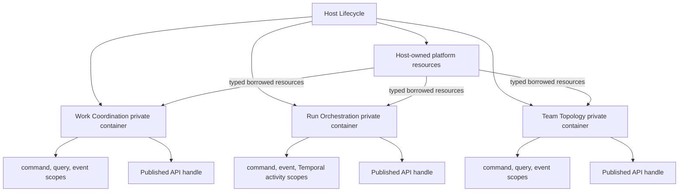

# Composition and Dependency Injection

## Purpose

Composition connects typed feature modules to concrete adapters without exposing
the dependency injection mechanism to business code. Package boundaries express
source ownership; containers express runtime construction and lifetime. These are
related but not interchangeable boundaries.

## Runtime topology



The Host owns bootstrap order, process signals, health aggregation, and ordered
shutdown. It constructs process-wide connections, clocks, telemetry, configuration,
and other shared technical resources. Context containers borrow only explicitly
listed capabilities and never dispose Host-owned resources.

Each bounded-context container is independent. It has no parent and cannot inspect,
resolve, register, or override another context's dependencies. A separately running
Host or Worker Thread creates a separate set of containers.

## Physical placement

```text
apps/<host>/src/composition/
  bootstrap.ts
  host-lifecycle.ts
  profiles/

packages/contexts/<context>/src/
  composition/
    awilix/
      create-context-container.ts
      registrations.ts
    lifecycle/
    create-context-handle.ts
  features/
    <feature>/
      domain/
      application/
      adapters/
      composition/
        feature-module-factory.ts
```

Directories are created only when their artifacts exist. This layout does not
authorize materializing a proposed context or empty DDD folders.

`FeatureModuleFactory` implementations are framework-neutral. They declare narrow
dependency objects and return narrow feature APIs. The context composition layer
maps those factories to Awilix registrations. Feature code never imports Awilix.
This static factory is distinct from a dynamic `ExtensionModuleDefinition` and
from a distributable `PluginArtifact`.

SDK, contracts, integration, platform, testing, and tooling packages use typed
factories by default. A package receives a container only when it owns an accepted
independent runtime lifecycle, not merely because it is large or reusable.

## Container contract

Awilix is allowed only below `composition/**`. Use:

- strict mode;
- explicit registrations and typed resolver maps;
- PROXY injection with destructured, narrowly typed dependencies;
- context-local registration names;
- one explicit composition entrypoint per context profile.

Do not use:

- `loadModules()` or filesystem scanning;
- decorators or reflection metadata;
- CLASSIC argument-name parsing;
- parent containers or cross-context fallback;
- raw cradle or container parameters in a feature factory;
- `container.resolve()` outside composition;
- dynamic singleton registration after startup;
- async network, process, filesystem, or database effects while resolving the
  dependency graph.

No application port abstracts the container. `ContainerPort`, `ServiceLocator`,
and general dependency registries are prohibited.

## Lifetimes and scopes

The context container lives for the context's process lifetime. A child operation
scope is created only when an inbound command, query, event delivery, or Temporal
activity needs scoped state such as Unit of Work, authorization facts, trace
context, or request-local idempotency handling.

Never create a container or long-lived scope per tenant, project, team, task, run,
or runtime session. Those are durable business or integration identities, not
dependency lifetimes.

A longer-lived registration cannot retain a shorter-lived dependency. Strict-mode
lifetime failures are architecture failures, not conditions to suppress. Every
created operation scope is disposed in `finally` after commit, rollback, and
post-commit intent handling have reached their defined boundary.

## Lifecycle

Dependency resolution constructs passive components only. Lifecycle code performs
external startup explicitly after construction. Startup proceeds in declared order;
shutdown proceeds in reverse order and is idempotent.

Do not rely on container disposal to infer business or infrastructure ordering.
The context lifecycle stops consumers and admission first, drains bounded work,
flushes owned dispatchers, closes context-owned connections, and only then disposes
the container. The Host stops contexts before shared resources.

Container restart has no business meaning. Durable runs, tasks, operations, inboxes,
and outboxes recover from their owning stores and workflow contracts.

## Context handle

Context bootstrap returns a narrow opaque handle conceptually shaped as:

```ts
interface ContextHandle<TPublishedApi> {
  readonly api: TPublishedApi;
  start(): Promise<void>;
  health(): Promise<ContextHealth>;
  stop(): Promise<void>;
}
```

The real type is owned by composition and contains no Awilix type. The container,
registrations, cradle, internal repositories, handlers, and operation-scope factory
are private.

## Cross-context collaboration

A consuming context receives a typed adapter implementing its consumer-owned port.
That adapter calls the provider's Published API or transport contract. Integration
events remain the preferred decoupling mechanism where synchronous collaboration is
not required.

The Host may wire one context API into another context's adapter, but it cannot pass
the provider container. Synchronous context dependencies form a directed graph.
Cycles require events, a process manager, or corrected domain ownership rather than
lazy container resolution.

## Profiles and replacement

Local and hosted Hosts construct the same context feature modules with different
adapter sets. Tests construct modules directly with fakes or use a test-only context
composition. Business tests do not start an Awilix container.

Tenant, project, workspace, run, and session identifiers may be authority inputs to
an operation, but never imply a container or module lifetime. Static context
composition initially has process and operation lifetimes. A future extension
runtime initially activates one immutable module generation at a time; broader
lifetime variants require independent qualification.

Awilix is replaceable because only composition imports it. Replacing the container
may change registration, scope, and lifecycle assembly, but cannot require changes
to domain, application, contracts, feature factories, or Published APIs.

## Enforcement

Architecture gates must prove:

- Awilix imports appear only in `composition/**`;
- feature modules and factories accept typed dependency objects, not a cradle;
- business code never calls `resolve`, creates a container, or performs dynamic
  registration;
- no parent container is constructed;
- valid and invalid lifetime and scope fixtures behave as specified;
- context handles expose no container implementation type;
- direct feature unit tests run without Awilix.

Oxlint and dependency graph rules own import direction. ast-grep owns structural
container-use patterns. Composition conformance tests own startup, scope disposal,
failure cleanup, and reverse-order shutdown behavior.
