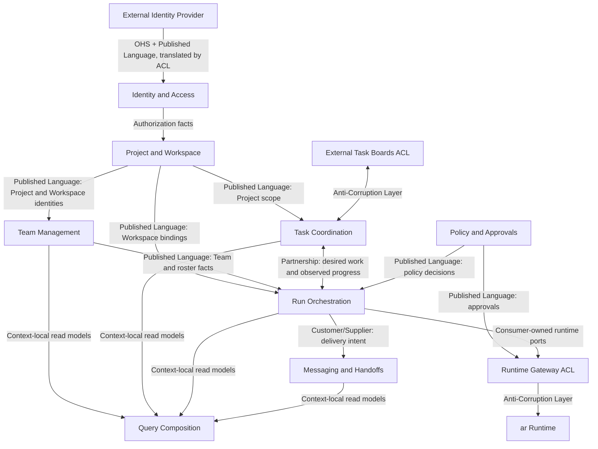

# Strategic Context Map

Status: **Proposed**

The scoping and ownership invariants in this document are mandatory. The precise
bounded-context boundaries remain proposed until validated through event storming,
current-system analysis, use cases, invariants, and concurrency scenarios.

## Subdomain classification

| Area | Classification | Reason |
|---|---|---|
| Run Orchestration | Core | Durable coordination, retry, completion, and recovery are differentiating behavior |
| Task Coordination | Core | Multi-agent assignment, dependency, subscription, and actual-work state are differentiating behavior |
| Messaging and Handoffs | Core | Typed agent communication and delivery policy directly affect coordination reliability |
| Team Management | Supporting | Teams and rosters support the core coordination model |
| Project and Workspace | Supporting | Owns project scope, workspace registration, and binding identities |
| Policy and Approvals | Supporting | Owns trust and execution-policy decisions |
| Identity and Access | Supporting or Generic | Maps authenticated principals to tenants, projects, roles, and machine clients |
| Runtime Gateway | Integration / ACL | Translates orchestration intent and `ar` runtime facts |
| External Task Boards | Integration / ACL | Translates Jira, todo, or desktop-board models |
| Query Composition | Edge composition | Joins published read models without owning business state |

`Runtime Gateway`, `External Task Boards`, and `Query Composition` are architectural
modules, not automatically DDD bounded contexts. Do not invent aggregates for
technical integration code.

## Proposed relationships

The arrows describe model ownership, not direct source-code imports. A consuming
context declares an outbound port. An adapter translates the provider's Published
Language or integration event into the consumer's model.

## Project and Workspace

Owns:

- project identity and lifecycle;
- workspace registration and binding generation;
- the association between projects and workspaces;
- project-scoped references used by teams, tasks, runs, and messages;
- workspace metadata needed for policy decisions.

Candidate aggregates:

- `Project`
- `WorkspaceRegistration`

It does not decide whether execution is trusted or enforce sandbox isolation.
Policy and Approvals owns the decision; `ar` owns enforcement.

## Team Management

Owns:

- project-scoped team identity and lifecycle;
- membership and roles;
- team configuration intent;
- membership invariants.

Candidate aggregates:

- `Team`
- `TeamRoster`

It does not own agent processes, task progress, or provider sessions.

## Task Coordination

Owns:

- project-scoped tasks and task lifecycle;
- assignments and reassignment;
- blocking and dependency relationships;
- task-event subscriptions;
- declared work versus actual active work;
- synchronization intent for external task boards.

Candidate aggregates:

- `Task`
- `TaskDependency`
- `TaskSubscription`

`TaskDependencyGraph` must not become one unbounded aggregate. External boards use
an ACL and preserve external identifiers only in adapter-owned mappings.

## Run Orchestration

Owns:

- project-scoped orchestration-run lifecycle;
- desired execution plans;
- workflow checkpoints and timers;
- retry, escalation, completion, and compensation policy;
- durable process-manager state across tasks, messages, and runtime runs.

Candidate aggregates:

- `OrchestrationRun`
- `RunPlan`

It does not spawn provider processes. Temporal may implement workflow ports but
does not become the domain model.

## Messaging and Handoffs

Owns:

- typed messages and handoffs;
- product-level agent inbox policy;
- priority and deferred delivery;
- attachments as references;
- delivery intent and product-level acknowledgement.

Candidate aggregates:

- `Conversation`
- `AgentInbox`
- `MessageDelivery`

Runtime Gateway owns provider submission and runtime receipt mapping, not product
message policy. The event-consumer idempotency inbox is a separate technical
concept.

## Policy and Approvals

Owns:

- workspace trust decisions;
- approval policy;
- execution policy;
- limits and risk classifications;
- auditable policy decisions.

Workspace facts come from Project and Workspace. Runtime enforcement remains in
`ar`. This area may split after domain discovery if trust, approvals, and usage
limits demonstrate independent language and lifecycle.

## Identity and Access

Proposed ownership:

- tenant and project membership;
- human and machine principal mapping;
- orchestrator roles and authorization decisions;
- API-client identity and credential references.

It does not store provider credentials or runtime session secrets. Authentication
may remain an external upstream capability.

## Runtime Gateway

The ACL owns:

- narrow runtime capability ports;
- orchestration-to-runtime command translation;
- normalized runtime snapshots and events;
- approval request and answer translation;
- mapping orchestration identities to opaque runtime references.

It contains no provider implementation. OpenCode, Claude, and Codex drivers belong
in `ar`.

## Projections and query composition

Each write-side context owns its read models, checkpoint state, and rebuild logic.
Query Composition can join those published read models for desktop, web, CLI, or
third-party clients.

Query Composition:

- is disposable and rebuildable;
- does not own aggregates;
- does not write context tables;
- cannot become a hidden integration database;
- remains at an inbound/API edge.

## Relationship rules

- Synchronous collaboration uses a consumer-owned outbound port and an adapter to
  the provider's published contract.
- Asynchronous collaboration uses versioned integration events.
- A context never writes another context's storage.
- A context never imports another context's aggregate, repository, or application
  implementation.
- Cross-context identifiers are opaque value objects at the receiving boundary.
- Eventual consistency is explicit in status, error, and reconciliation models.
- Cyclic synchronous context dependencies are prohibited.

## Acceptance criteria

Before changing this document to Accepted:

1. map the current desktop and legacy-orchestrator capabilities to owners;
2. event-storm team creation, task assignment, handoff, cancellation, recovery,
   approval, and partial member failure;
3. define invariants and transaction boundaries for candidate aggregates;
4. validate project and tenant isolation;
5. identify upstream/downstream and consistency requirements for each relationship;
6. verify that external boards and `ar` remain behind ACLs;
7. record the accepted map in an ADR.
