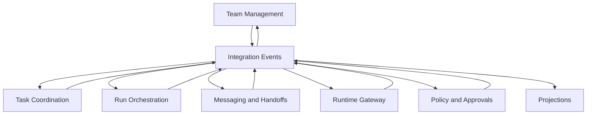

# Context Map

Status: **Accepted initial boundaries**

These boundaries are the starting context map. Aggregate details may evolve, but
ownership must not move silently between contexts.

## Team Management

Owns:

- team identity and lifecycle;
- membership and roles;
- team configuration intent;
- membership invariants.

Candidate aggregates:

- `Team`
- `TeamRoster`

Does not own agent processes, task progress, or provider sessions.

## Task Coordination

Owns:

- tasks and task lifecycle;
- assignments and reassignment;
- blocking and dependency relationships;
- task subscriptions and coordination state;
- the distinction between declared and actively executed work.

Candidate aggregates:

- `Task`
- `TaskDependencyGraph`
- `TaskSubscription`

External boards such as Jira are adapters. No board-specific identifier or status
model belongs in the core domain without translation.

## Run Orchestration

Owns:

- orchestration-run lifecycle;
- desired execution plans;
- workflow checkpoints and timers;
- retry, escalation, completion, and compensation policy;
- durable coordination state.

Candidate aggregates:

- `OrchestrationRun`
- `RunPlan`

It does not spawn provider processes. Temporal will implement a workflow port and
must not become the domain model.

## Messaging and Handoffs

Owns:

- typed messages and handoffs;
- inbox policy and delivery intent;
- priority and deferred delivery;
- attachments as references;
- message acknowledgements and delivery state.

Candidate aggregates:

- `Conversation`
- `Inbox`
- `Delivery`

Provider-specific prompt submission is delegated through Runtime Gateway.

## Runtime Gateway

Owns the anti-corruption boundary between orchestration concepts and `ar`:

- runtime capabilities;
- desired-run commands;
- normalized runtime snapshots;
- normalized runtime events;
- approval requests and answers;
- mapping orchestration identities to opaque runtime references.

It contains no provider implementation. OpenCode, Claude, and Codex drivers belong
in `ar`.

## Policy and Approvals

Owns:

- workspace trust decisions;
- approval policy;
- execution policy;
- limits and risk classifications;
- policy decisions that can be audited independently.

Authentication and secret storage are infrastructure concerns exposed through
narrow ports.

## Projections

Owns query-optimized read models for:

- desktop and web views;
- run timelines;
- task activity;
- runtime status;
- messages and delivery state;
- audit and diagnostics.

Projections are disposable and rebuildable. They are not aggregate repositories.

## Relationship rules

- Contexts communicate synchronously only through explicit public application
  contracts when an immediate answer is required.
- State propagation and reactions use versioned integration events.
- A context never writes another context's storage.
- A context never imports another context's aggregate or repository.
- Cross-context identifiers are opaque value objects at the receiving boundary.
- Eventual consistency must be visible in status and error models.
