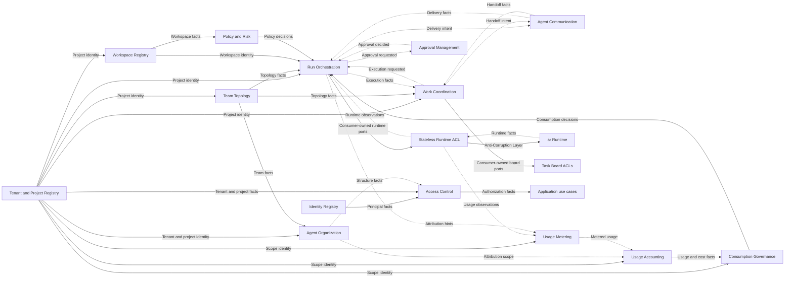

# Strategic Context Map

The map identifies model boundaries and relationships. It does not redefine the
Ubiquitous Language, invariants, aggregates, or process models owned by each
[bounded-context dossier](../domain/contexts/README.md).

There is no numerical target or ceiling. Contexts are added, merged, split, or
retired only from differences in language, ownership, invariants, lifecycle,
consistency, security, and evolution. A proposed boundary is not permission to
materialize an empty package or freeze a schema.

## Mapping vocabulary

- A business capability describes what the product can do.
- A subdomain classifies business value as core, supporting, or generic.
- A bounded context owns one consistent model and Ubiquitous Language.
- A workspace package is a physical boundary created after acceptance.
- A feature is a cohesive capability inside one bounded context, not a smaller
  context by default.

These concepts often align, but they are not interchangeable.

## Strategic business contexts

| Bounded context | Classification | Boundary status | Primary responsibility | Domain authority |
|---|---|---|---|---|
| Identity Registry | Generic | Proposed | Human and machine principal identity | [Dossier](../domain/contexts/identity-registry/README.md) |
| Access Control | Supporting | Proposed | Membership, grants, and authorization facts | [Dossier](../domain/contexts/access-control/README.md) |
| Tenant and Project Registry | Supporting | Proposed | Tenant/project identity, lifecycle, and ownership | [Dossier](../domain/contexts/tenant-project-registry/README.md) |
| Workspace Registry | Supporting | Proposed | Workspace registration, binding generations, and metadata | [Dossier](../domain/contexts/workspace-registry/README.md) |
| Team Topology | Core | Proposed | Agent-team composition, roles, capabilities, and roster rules | [Dossier](../domain/contexts/team-topology/README.md) |
| Agent Organization | Core | Accepted by ADR-0044 | Tenant-scoped organizations, units, structures, and team placements | [Dossier](../domain/contexts/agent-organization/README.md) |
| Work Coordination | Core | Proposed | Tasks, assignments, dependencies, handoffs, and work lifecycle | [Dossier](../domain/contexts/work-coordination/README.md) |
| Run Orchestration | Core | Proposed | Durable business execution coordination and recovery policy | [Dossier](../domain/contexts/run-orchestration/README.md) |
| Agent Communication | Core | Proposed | Typed team communication, delivery intent, inbox policy, and receipts | [Dossier](../domain/contexts/agent-communication/README.md) |
| Policy and Risk | Supporting | Proposed | Workspace trust, execution policy, risk classification, and controls | [Dossier](../domain/contexts/policy-risk/README.md) |
| Approval Management | Supporting | Proposed | Product approval lifecycle, routing, decisions, and audit | [Dossier](../domain/contexts/approval-management/README.md) |
| Usage Metering | Supporting | Accepted by ADR-0045 | Observations, normalization, corrections, meters, and quantities | [Dossier](../domain/contexts/usage-metering/README.md) |
| Usage Accounting | Supporting | Accepted by ADR-0045 | Attribution, rating, exact cost, reconciliation, and projections | [Dossier](../domain/contexts/usage-accounting/README.md) |
| Consumption Governance | Supporting | Accepted by ADR-0045 | Budgets, alerts, limits, reservations, and consumption decisions | [Dossier](../domain/contexts/consumption-governance/README.md) |

Boundary status and dossier readiness are intentionally different. An ADR may
accept a strategic split while its dossier remains proposed until Full DDD
discovery proves exact aggregates, scenarios, and concurrency.

## Integration modules

These are architectural integration modules, not business bounded contexts:

- Runtime ACL;
- external Task Board ACLs;
- Query Composition;
- transport adapters;
- persistence drivers;
- schema registry;
- observability.

They translate, transport, persist, or compose information. They do not invent
business aggregates or become authorities for business lifecycle.

## Relationship map

Arrows describe semantic information flow, not source imports. Every relationship
must declare an upstream owner, downstream translation, consistency, delivery,
latency, and failure behavior before implementation.

`Application use cases` is an authorization-consumption boundary, not another
bounded context. Bidirectional information flow never authorizes cyclic package
imports.

## Relationship catalog

| Upstream | Downstream | Integration style | Authority |
|---|---|---|---|
| Identity Registry | Access Control | Published principal facts | Identity owns identity; Access owns grants |
| Tenant and Project Registry | Other business contexts | Published tenant/project references | Registry owns lifecycle; consumers own local opaque references |
| Access Control | Every protected use case | Consumer-owned decision port or context-local grant projection | Access owns authorization facts; consumer owns operation policy |
| Team Topology | Organization, Work, Run | Versioned team facts | Team owns roster and lifecycle |
| Agent Organization | Access, Accounting, policy consumers | Versioned structure facts | Organization owns semantic hierarchy, not grants or accounting |
| Workspace Registry | Policy and Risk, Run | Workspace facts and opaque references | Workspace owns registration; Policy owns trust |
| Work Coordination | Run Orchestration | Versioned execution requests and work facts | Work owns work lifecycle; Run owns business execution |
| Run Orchestration | Agent Communication | Delivery intent and delivery facts | Run owns run policy; Communication owns product delivery |
| Policy and Risk | Run Orchestration | Policy decision contract | Policy owns risk decision; Run applies it |
| Approval Management | Run Orchestration | Approval facts | Approval owns product decision; Run owns consequence |
| Usage Metering | Usage Accounting | Exact normalized usage facts | Metering owns measurement |
| Usage Accounting | Consumption Governance | Rated usage and cost facts | Accounting owns attribution and rating |
| Consumption Governance | Run Orchestration | Reservation and consumption decision contract | Governance owns budget/quota decision |
| Run Orchestration | Runtime ACL and AR | Consumer-owned ports plus AR Published Language | Run owns orchestration intent; AR owns execution |
| Work Coordination | Task Board ACLs | Consumer-owned ports and external mappings | Work owns canonical work semantics |

Detailed message names, aggregate reactions, and latency budgets remain in the
owning dossiers, contract schemas, and open decisions.

## Cross-context identity namespaces

Three identities must never be aliased:

| Identity | Owner | Meaning |
|---|---|---|
| `PrincipalId` | Identity Registry | Authenticated human or machine actor |
| `AgentProfileId` | Team Topology | Product-level agent definition |
| `RuntimeSessionRef` | AR | Opaque technical runtime session reference |

Associations among them are explicit, scoped, lifecycle-aware bindings owned by
the context that needs the relationship. Authentication does not create an agent
profile, and replacing a runtime session does not change product identity.

## Relationship rules

- A synchronous consumer declares a narrow outbound port and translates the
  provider Published Language through an ACL or context bridge.
- Asynchronous collaboration uses versioned integration events.
- A context never writes another context's tables, inbox, outbox, feed, or
  projection.
- One event handler changes state in one bounded-context transaction.
- A context never imports another context's aggregate, repository, application
  implementation, or adapter.
- Cross-context references are opaque local value objects.
- Eventual consistency is explicit in states, errors, reconciliation, and UX.
- Cyclic synchronous context dependencies and cyclic package imports are
  prohibited.

## Evidence gate

Before a proposed context package is materialized:

1. map business capabilities and domain vision;
2. event-storm representative success, failure, cancellation, recovery, and
   concurrency scenarios;
3. establish context-specific Ubiquitous Language;
4. prove invariants, aggregate and transaction boundaries, and conflict policy;
5. define commands, domain events, policies, process managers, and errors;
6. define every upstream/downstream contract and consistency expectation;
7. validate tenant/project isolation and external ACL boundaries;
8. map legacy behavior to exactly one future owner;
9. record unresolved detail in addressable open decisions;
10. accept the validated boundary before production package creation.
