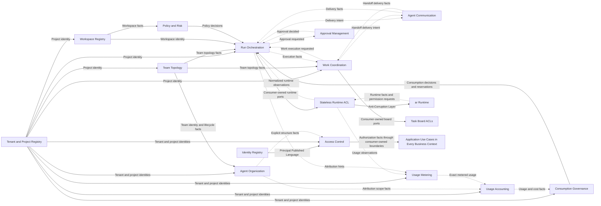

# Strategic Context Map

The map uses as many focused business bounded contexts as domain evidence requires.
There is no numerical target or ceiling. Contexts must be independently
understandable and extractable without turning every use case into a distributed
subsystem or merging unrelated models to satisfy a package count.

Exact boundaries remain proposed until validated through business-capability
mapping, event storming, current-system analysis, invariants, language differences,
and concurrency scenarios. A proposed context name is not permission to freeze its
package, schema, or public contract prematurely.

## Terms and mapping

- A business capability describes what the product can do.
- A subdomain classifies business value as core, supporting, or generic.
- A bounded context owns one consistent model and Ubiquitous Language.
- A workspace package is the physical boundary used after a bounded context is
  accepted.
- A feature is a cohesive domain capability inside one bounded context. It is not a
  smaller bounded context by default.

These concepts often align, but they are not interchangeable.

## Strategic business contexts

| Bounded context | Classification | Boundary status | Primary responsibility |
|---|---|---|---|
| Identity Registry | Generic | Proposed | Human and machine principal identity |
| Access Control | Supporting | Proposed | Tenant/project membership, grants, and authorization facts |
| Tenant and Project Registry | Supporting | Proposed | Tenant/project identity, lifecycle, and ownership |
| Workspace Registry | Supporting | Proposed | Workspace registration, binding generations, and metadata |
| Team Topology | Core | Proposed | Agent-team composition, roles, capabilities, and roster invariants |
| Agent Organization | Core | Accepted by ADR-0044 | Tenant-scoped organizations, units, structures, and team placements |
| Work Coordination | Core | Proposed | Tasks, assignments, dependencies, handoffs, and work lifecycle |
| Run Orchestration | Core | Proposed | Durable execution coordination, retries, compensation, and recovery policy |
| Agent Communication | Core | Proposed | Typed agent communication, delivery intent, inbox policy, and receipts |
| Policy and Risk | Supporting | Proposed | Execution policy, workspace trust, risk classification, and controls |
| Approval Management | Supporting | Proposed | Product approval requests, authority decisions, routing, expiry, and audit |
| Usage Metering | Supporting | Accepted by ADR-0045 | Observations, normalization, corrections, meters, and exact quantities |
| Usage Accounting | Supporting | Accepted by ADR-0045 | Attribution, rating, exact cost, reconciliation, and projections |
| Consumption Governance | Supporting | Accepted by ADR-0045 | Budgets, alerts, limits, reservations, and consumption decisions |

## Accepted strategic additions

ADR-0044 accepts tenant-scoped Agent Organization. ADR-0045 accepts three distinct
usage bounded contexts. ADR-0046 accepts their exact-value strategy. Their dossiers
remain proposed until the Full DDD acceptance gate validates exact aggregates,
commands, events, relationships, and concurrency models. Acceptance of a strategic
boundary reserves topology but does not authorize empty package materialization.

### Agent organization

The product requires tenant-scoped semantic organization hierarchies above teams.
Groups with lifecycle, responsibility, policy bindings, or process references are
OrganizationalUnits rather than UI folders. OD-023 owns the remaining detailed
hierarchy, placement, relationship, and concurrency model.

### Usage, accounting, and consumption controls

Usage Metering, Usage Accounting, and Consumption Governance own measurement,
attribution/rating, and budget/limit authority respectively. OD-024 owns their
remaining detailed semantics and executable concurrency scenarios.

## Integration modules

The following are architectural integration modules, not business bounded contexts:

- Runtime ACL;
- External Task Board ACLs;
- Query Composition;
- transport adapters;
- persistence drivers;
- schema registry;
- observability.

They must not invent aggregates or become owners of business state.

## Proposed relationships

The arrows describe semantic information flow, not source-code imports. Each
relationship must identify an upstream contract owner, a downstream translation,
delivery semantics, consistency expectations, and allowed latency.

`Application Use Cases in Every Business Context` is an authorization-consumption
boundary, not another bounded context.

Bidirectional event flow does not permit cyclic package imports. Each direction uses
the producer's Published Language and a consumer-owned handler or ACL.

## Identity Registry

Owns:

- human and machine principal identities;
- mappings to an external identity provider;
- principal lifecycle and status;
- authentication identity facts exposed to Access Control.

It does not decide whether a principal may perform a domain operation.

### Identity namespaces

Three identity namespaces are deliberately distinct:

- `PrincipalId` identifies an authenticated human or machine actor and belongs to
  Identity Registry;
- `AgentProfileId` identifies a product-level agent definition and belongs to Team
  Topology;
- `RuntimeSessionRef` is an opaque reference to an AR-owned technical execution
  session.

These identifiers are never aliases and no one-to-one relationship is assumed.
Any association between them is an explicit, scoped, lifecycle-aware binding owned
by the context that needs the association. Authentication does not make a
principal an agent profile, and starting or replacing a runtime session does not
change either product identity.

## Access Control

Owns:

- tenant and project membership;
- role and grant assignments;
- machine-client grants;
- authorization facts required by application use cases.

Inbound adapters authenticate a principal. Application use cases authorize every
business operation using Access Control facts. Domain models enforce business
invariants using explicit actor or capability facts where identity matters.

No inbound transport may bypass application authorization.

Other contexts do not import Access Control application code. They consume
authorization through a consumer-owned decision port or a context-local grant
projection built from versioned Access Control events. Each contract defines
freshness, revocation, fail-closed behavior, and which operations require a
synchronous authoritative decision.

## Tenant and Project Registry

Owns:

- tenant identity and lifecycle;
- project identity and lifecycle;
- project-to-tenant ownership;
- project metadata and archival state;
- stable tenant and project references published to downstream contexts.

Other contexts own their local opaque `ProjectId` representation and do not import
the Project aggregate.

## Workspace Registry

Owns:

- workspace registration and binding generation;
- project-to-workspace association;
- workspace location references and metadata;
- lifecycle facts needed by policy evaluation and runtime admission.

It does not decide trust or enforce sandbox isolation. Policy and Risk owns the
decision; `ar` owns runtime enforcement.

Candidate aggregate:

- `WorkspaceRegistration`

## Team Topology

Owns:

- project-scoped team identity and lifecycle;
- agent-member composition;
- roles and declared capabilities;
- roster invariants and topology versions.

Candidate aggregate:

- `Team`

`TeamRoster` remains an entity or collection inside `Team` unless independent
concurrency and lifecycle prove that it needs a separate aggregate.

It does not own agent processes, tasks, or provider sessions.

## Agent Organization

Owns:

- tenant-scoped Organization identity and lifecycle;
- named OrganizationStructure topology;
- semantic OrganizationalUnit identity, nesting, and lifecycle;
- project-qualified TeamPlacement references;
- typed organization relationships and published structure facts.

Team Topology remains authoritative for Team identity and roster. Tenant and
Project Registry remains authoritative for tenant/project identity. Tasks, runs,
budgets, approvals, and policies may reference organization subjects but remain
owned by their contexts.

Containment is cycle-free per Structure. Matrix organization uses multiple
structures or typed relationships, not unrestricted containment. Organization
facts do not grant access implicitly.

## Work Coordination

Owns:

- project-scoped task identity and lifecycle;
- assignment and reassignment;
- blocking and dependency semantics;
- work handoff semantics and responsibility transfer;
- task-event subscriptions;
- decisions that accept execution facts and change task state;
- synchronization intent for external task boards.

Candidate aggregate:

- `Task`

`TaskDependency`, `TaskSubscription`, and dependency-graph structures remain
candidate entities, aggregates, or process state until their invariants and
concurrency boundaries are proven.

Execution activity is observed from Run Orchestration. `Actual active work` is a
Work Coordination projection derived from execution evidence, not a second
authoritative runtime state.

Work Coordination remains the only authority that changes `Task` or `Work`
lifecycle. It accepts versioned commands and publishes explicit work facts; it
does not infer Run cancellation, compensation, or participant-failure policy.

External boards preserve external identifiers only in ACL-owned mappings.

## Run Orchestration

Owns:

- project-scoped orchestration-run lifecycle;
- desired execution plans;
- business checkpoints and run-specific process-manager state;
- business retry, escalation, completion, and compensation policy;
- runtime binding between orchestration intent and opaque `ar` references;
- desired-versus-observed reconciliation;
- context-owned runtime observation inboxes, cursors, and projections.

Candidate aggregate:

- `OrchestrationRun`

`RunPlan` and `RuntimeBinding` remain entities, value objects, or separate
aggregates until invariants and concurrency requirements prove otherwise.

Run Orchestration is authoritative for business run state. The active workflow
engine owns durable scheduling history, wakeups, and activity retries. `ar` owns
agent execution, sessions, processes, leases, fencing, and recovery mechanisms.

A feature-owned `WorkExecutionProcessManager` in Run Orchestration coordinates
long-running Run-to-Work behavior. It stores stable references, expected
revisions, checkpoints, and process policy state rather than copying the Work
aggregate. Cross-context effects use versioned commands and facts; each context
commits its own state, inbox or receipt, and outbox in its own Unit of Work.
Compensation is a durable idempotent command, never a cross-context rollback.

## Usage Metering

Owns immutable source observations, deduplication, provider-neutral normalization,
corrections, versioned meter definitions, and exact metered quantities. It does not
own pricing, attribution, budgets, or runtime execution.

## Usage Accounting

Owns attribution decisions, effective-dated rate cards, rated usage, exact cost,
provider reconciliation, and usage/cost projections. It does not own invoices,
payments, raw provider normalization, or hard-limit authority.

## Consumption Governance

Owns user budgets, alert thresholds, soft limits, hard quotas, reservations,
capture/release, expiry, reconciliation, and consumption decisions. Run
Orchestration consumes those decisions; Policy and Risk may compose them into a
broader admission policy; AR performs only technical runtime enforcement.

Hard-limit policies declare reservation estimates and permitted overshoot because
provider usage can arrive after execution has consumed resources.

## Agent Communication

Owns:

- typed messages;
- product-level agent inbox policy;
- priority and deferred delivery;
- attachments as references;
- delivery intent, attempts, receipts, and product-level acknowledgement.

Candidate aggregates:

- `Conversation`
- `MessageDelivery`

An inbox may be a projection or delivery queue rather than an aggregate. This must
be decided from invariants and concurrency, not from the noun alone.

Agent Communication does not decide task completion, assignment, or handoff
semantics. Work Coordination owns the handoff; Agent Communication transports its
communication. Provider output and technical runtime input belong to `ar`; this
context owns only product-level team communication and delivery semantics.

## Policy and Risk

Owns:

- workspace trust decisions;
- execution and tool policy;
- risk classifications;
- capability-profile selection;
- risk controls that protect execution, excluding consumption budgets and quotas;
- auditable policy evaluations.

Domain policies that enforce invariants cannot be replaced by plugins. An external
policy engine may supply facts or evaluate an explicitly declared outbound port,
but the owning domain validates and applies the result.

## Approval Management

Owns:

- product approval-request lifecycle;
- eligible approvers;
- decision routing;
- approval, rejection, expiry, and revocation as product decisions;
- auditable decision evidence.

Candidate aggregate:

- `ApprovalRequest`

Policy and Risk decides when approval is required. Approval Management records the
decision. Run Orchestration decides how that fact changes a run.

A technical `RuntimePermissionRequest` remains owned by `ar`. Approval Management
may create an `ApprovalRequest` correlated to that opaque request, route it to an
authority, and retain an opaque authority decision reference. It does not own the
runtime request revision, execution fence, capability grant, or provider
enforcement state.

Product-level message inboxes belong to Agent Communication. Technical event
consumer inboxes belong to the consuming bounded context's delivery
infrastructure. They never share one type, port, table, retention policy, or
acknowledgement state.

## Runtime ACL

The Runtime ACL is a stateless anti-corruption integration boundary composed of
role-specific adapters. Its outbound command adapter implements consumer-owned
runtime capability ports. Its inbound event adapter translates `ar` events and
invokes context-owned ingestion use cases. They may share low-level connection
resources supplied by composition but do not form one broad bidirectional adapter.
Durable ingestion cursors and inbox state belong to the consuming context.

The boundary:

- implements narrow ports owned by consuming application code;
- translates orchestration commands to `ar` contracts;
- maps `ar` facts into application inputs for consumer-owned observation models;
- translates technical runtime permission requests and decisions without taking
  ownership of either side's durable state;
- preserves opaque runtime references;
- treats runtime session, attempt, epoch, allocation, account, and custody
  concepts as AR-owned observations rather than mirrored orchestrator entities;
- contains no provider implementation.

OpenCode, Claude, Codex, and other provider drivers belong in `ar`.

## Context relationship rules

- A synchronous consumer declares a narrow outbound port and translates the
  provider's Published Language through an ACL or context bridge.
- Asynchronous collaboration uses versioned integration events.
- A context never writes another context's tables, inbox, outbox, or projections.
- One event handler changes state in one bounded context transaction only.
- A context never imports another context's aggregate, repository, application
  implementation, or adapter.
- Cross-context identifiers are opaque local value objects.
- Eventual consistency is explicit in state, errors, reconciliation, and UX.
- Cyclic synchronous context dependencies and cyclic package imports are prohibited.

## Aggregate and feature rules

- Aggregate boundaries come from invariants and transactional consistency, not
  nouns or directory names.
- One domain capability feature owns each aggregate implementation.
- Another feature in the same bounded context may use an explicit context-internal
  API, stable identity, or shared Ubiquitous Language type.
- Another feature does not mutate an aggregate through its repository or internals.
- Cross-aggregate workflows use application coordination, domain services where
  truly stateless, or explicit process managers.
- Published Language and ACLs are mandatory across bounded contexts, not between
  every pair of features inside one context.

## Full DDD acceptance criteria

Before exact context packages are accepted:

1. create a business-capability map and domain vision;
2. event-storm team creation, assignment, handoff, cancellation, recovery,
   approval, partial failure, review, and completion;
3. define a Ubiquitous Language map for every core context;
4. record aggregate invariants, transaction boundaries, and concurrency models;
5. define commands, domain events, policies, process managers, and domain errors;
6. define upstream/downstream ownership, Published Language, consistency, and
   latency for every context relationship;
7. validate project and tenant isolation;
8. map current desktop and legacy-orchestrator behavior to one owner;
9. verify that external boards and `ar` remain behind ACLs;
10. accept the validated map through a new ADR before creating all context packages.
