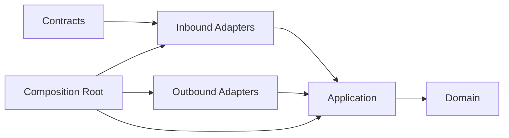

# Dependency Rules

Status: **Accepted**

## Dependency direction



Dependencies point inward. Runtime calls may flow outward through interfaces, but
source-code dependencies do not.

## Allowed dependency matrix

| From | May depend on |
|---|---|
| Domain | Feature domain, minimal kernel |
| Application | Feature domain, feature contracts, application ports, minimal kernel |
| Contracts | Schema primitives and minimal contract kernel |
| Inbound adapters | Feature contracts and application input ports |
| Outbound adapters | Application output ports and external libraries |
| Composition | All layers in its own package and public APIs of dependencies |
| SDK | Published contracts and transport libraries |

## Forbidden dependencies

Domain and application layers must not import:

- Electron, React, browser globals, or frontend stores;
- NATS, Temporal, HTTP servers, gRPC servers, or broker clients;
- `ar` implementation modules;
- OpenCode, Claude, Codex, or other provider SDKs;
- Node filesystem, child-process, or network implementations;
- concrete database clients;
- another bounded context's internal modules.

## Cross-context dependencies

Synchronous collaboration uses a narrow public application facade. Asynchronous
collaboration uses integration-event contracts. A package may not import another
package's domain layer.

Cycles between bounded-context packages are prohibited. When two contexts need
bidirectional collaboration, use events or move the genuinely shared concept to
the context that owns its lifecycle.

## Enforcement

The implementation phase must add automated architecture tests for:

- package export boundaries;
- forbidden imports by layer;
- cross-context deep imports;
- dependency cycles;
- provider-specific symbols in domain/application;
- transport-specific symbols in contracts;
- unversioned integration events.

TypeScript path aliases are conveniences, not boundaries. `package.json` exports,
workspace dependencies, lint rules, and architecture tests enforce boundaries.

## Dependency inversion examples

The application declares:

```ts
interface AgentRuntimePort {
  startRun(command: StartRunCommand): Promise<StartRunResult>;
}
```

An adapter implements it using `ar`. The application never imports the `ar`
client.

The application declares an `EventPublisherPort`; a JetStream adapter implements
it. Replacing JetStream must not change domain or application code.
