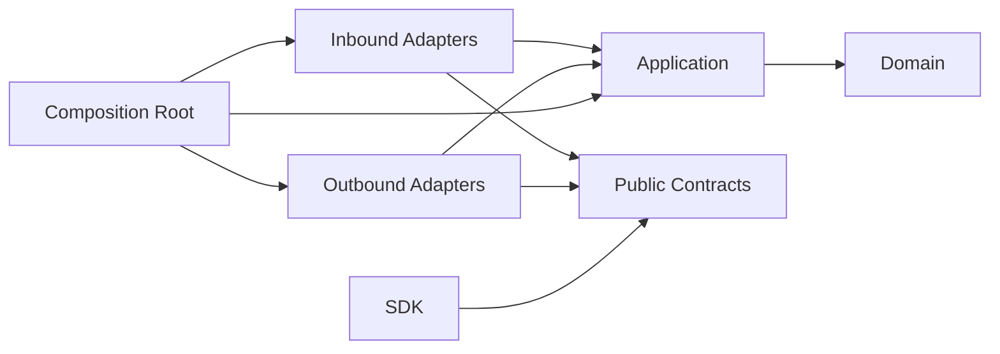

# Dependency Rules

## Dependency direction



Dependencies point inward. Runtime calls may flow outward through interfaces, but
source-code dependencies do not.

The words `inbound` and `outbound` are always relative to the application core:

- inbound adapters call application inbound ports and initiate use cases;
- outbound adapters implement application outbound ports and are called by use
  cases;
- network direction and payload flow do not classify an adapter.

A streaming HTTP response remains part of an inbound HTTP adapter because the
external client initiated the use case. A JetStream publisher is outbound, while a
JetStream consumer that initiates a use case is inbound. Integrations that perform
both roles expose separate modules and ports for each role.

## Allowed dependency matrix

| From | May depend on |
|---|---|
| Domain | Owning context domain modules and explicitly exposed context-internal domain types |
| Application | Owning context domain, application models, internal APIs, and consumer-owned ports |
| Contracts | Narrow Protobuf or JSON Schema primitives allowed by the owning external surface |
| Inbound adapters | Feature contracts and application input ports |
| Outbound adapters | Application output ports, public event contracts when publishing, and external libraries |
| Composition | All layers in its own package and public APIs of dependencies |
| SDK | Published contracts and transport libraries |

Awilix and every other container implementation are composition dependencies, not
application ports. They may be imported only below `composition/**`. Contexts,
features, adapters, and SDKs cannot receive a raw container, cradle, resolver, or
service locator.

## Forbidden dependencies

Domain and application layers must not import:

- public SDK, HTTP, gRPC, JSON-RPC, or integration-event schemas;
- Electron, React, browser globals, or frontend stores;
- NATS, Temporal, HTTP servers, gRPC servers, or broker clients;
- `ar` implementation modules;
- OpenCode, Claude, Codex, or other provider SDKs;
- Node filesystem, child-process, or network implementations;
- concrete database clients;
- another bounded context's internal modules.

Domain and application models also cannot expose JavaScript `Date`, ECMAScript
Temporal objects, Decimal/Dinero instances, ORM records, or driver values. A pure
arithmetic library may be private to a context-owned value-object implementation
only when its type and mutable configuration cannot escape. Timezone/calendar
engines belong behind application-owned calculation ports.

## Cross-context dependencies

For synchronous collaboration, the consuming context declares a narrow outbound
port. An adapter implements that port against the provider context's published
contract. Asynchronous collaboration uses integration-event contracts.

Cycles between bounded-context packages are prohibited. When two contexts need
bidirectional collaboration, prefer events, a process manager, or move the
genuinely shared concept to the context that owns its lifecycle. Do not solve a
cycle by importing both public application facades.

A direct in-process adapter is permitted as a deployment optimization, but it must
implement the same consumer-owned port and published contract used by a future
remote adapter.

Inside one bounded context, features may use explicit context-internal APIs and a
directed module dependency graph. They do not need Published Language or ACL
ceremony for every collaboration. They still cannot mutate another feature's
aggregate through its repository or internals.

## Contract surfaces

The following surfaces are distinct:

- application input/output models, private to use cases;
- context-internal module APIs, private to one bounded context;
- context Published Language, versioned for downstream contexts;
- integration events, versioned asynchronous facts;
- public control API contracts, versioned for SDK clients;
- external dependency contracts such as `ar`.

Sharing similar fields is not sufficient reason to reuse one surface as another.
Mappings protect ownership, compatibility, authorization, and disclosure rules.

Each surface starts with one explicit `v1` family. Parallel speculative major
versions are prohibited. A later major requires the migration decision and support
horizon defined by ADR-0037.

## Enforcement

CI architecture gates test:

- production source outside approved feature or package-assembly roots;
- packages without an explicit architectural role;
- production packages absent from `architecture/package-catalog.yaml`;
- packages whose owner document remains proposed;
- package manifests whose name, role, or owner differs from the catalog;
- empty ceremonial DDD layers;
- package export boundaries;
- forbidden imports by layer;
- cross-context deep imports;
- dependency cycles;
- provider-specific symbols in domain/application;
- public contract imports in domain/application;
- transport-specific symbols in contracts;
- unversioned integration events.
- one public control contract represented by both hand-authored Protobuf and JSON
  Schema sources;
- public Protobuf outside the accepted cross-language profile;
- context packages importing consumer-owned ports from an integration adapter;
- feature dependency cycles inside a bounded context;
- broad `spi` and package-root barrel exports.
- adapters classified from network direction instead of application-core
  direction;
- one broad adapter module combining inbound and outbound responsibilities.

TypeScript path aliases are conveniences, not boundaries. `package.json` exports,
workspace dependencies, lint rules, and architecture tests enforce boundaries.
The package catalog reserves approved topology; it does not replace import-graph
enforcement inside materialized packages.

The package-role gate prevents platform packages from depending on business
contexts, integrations from depending on contexts or SDKs, and SDKs from depending
on contexts, integrations, or platform implementation packages. Internal workspace
dependencies must be cataloged and use the `workspace:` protocol. Dev-only testing
packages are the explicit exception to runtime role direction.

The published `@agent-teams/engineering-foundation` package is the only external
package allowed in the reserved scope. It must use an exact registry version in
`devDependencies`; runtime, optional, and peer declarations are prohibited.
Production source under `apps/**/src` and `packages/**/src` cannot import it.
Architecture fixtures prove both the valid dev-only declaration and invalid
declaration and import cases.

Foundation 0.3 provides reusable declaration checks through
`workspace.dependency-declarations` and a separately activated
`architecture.source-dependencies` capability. This repository currently enables
only the declaration capability: catalog exactness, catalog references, workspace
protocols, reserved-scope resolution, unique package identities, and
development-only placement. The repository-local dependency validator remains a
temporary blocking donor oracle and continues to own production source import
checks until the foundation source capability is parity-proven here. One
conformance fixture runs both declaration validators over the same mutations and
asserts the foundation's stable rule IDs; source-import mutations are expected to
fail only the donor during this observation window.

Cross-package source imports must name a declared manifest dependency and use a
subpath exposed by the target package `exports`. Imports through another package's
`src/**` are always prohibited. These checks enforce package encapsulation only;
the exact `architecture/source-dependency-policy.yaml` edge and package-role
matrix decide whether a source dependency is allowed. LikeC4 remains the
authority for semantic relationships and never grants source imports by itself.

The source dependency policy is default-deny. Every edge names one consumer, one
provider, and exact provider export subpaths. Cross-package relative imports,
package-root and wildcard imports, `file:` or absolute imports, and package-local
aliases that target another package are prohibited. Type-only, dynamic,
re-exported, test, generated, and composition imports follow the same policy.

## Dependency inversion examples

The consuming application declares a narrow capability:

```ts
interface RuntimeSessionLifecyclePort {
  startSession(
    command: StartRuntimeSessionCommand,
  ): Promise<StartRuntimeSessionResult>;
}
```

An adapter implements it using `ar`. The application never imports the `ar`
client.

The application creates publication intent; a context-owned persistence adapter
stores a complete outbox record in the same local transaction as business state,
and a JetStream relay publishes it later. Replacing JetStream must not change
domain or application code.
