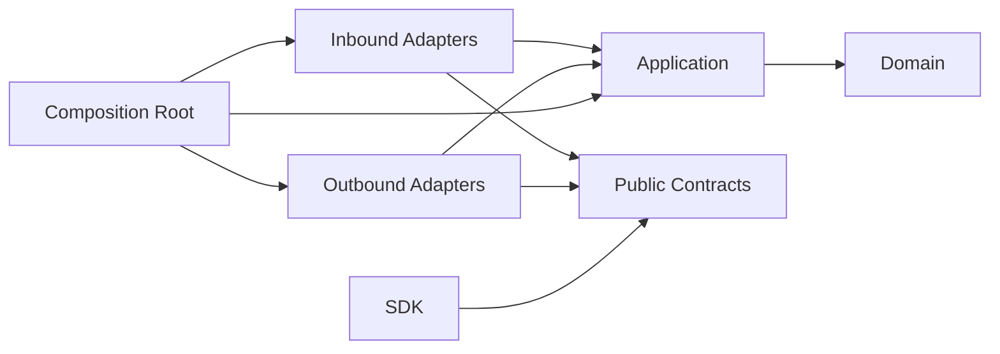

# Dependency Rules

Status: **Accepted**

## Dependency direction



Dependencies point inward. Runtime calls may flow outward through interfaces, but
source-code dependencies do not.

## Allowed dependency matrix

| From | May depend on |
|---|---|
| Domain | Owning context domain modules and explicitly exposed context-internal domain types |
| Application | Owning context domain, application models, internal APIs, and consumer-owned ports |
| Contracts | Narrow language-neutral schema primitives only |
| Inbound adapters | Feature contracts and application input ports |
| Outbound adapters | Application output ports, public event contracts when publishing, and external libraries |
| Composition | All layers in its own package and public APIs of dependencies |
| SDK | Published contracts and transport libraries |

## Forbidden dependencies

Domain and application layers must not import:

- public SDK, HTTP, gRPC, JSON-RPC, or integration-event schemas;
- Electron, React, browser globals, or frontend stores;
- NATS, Temporal, HTTP servers, gRPC servers, or broker clients;
- `ar` implementation modules;
- OpenCode, Claude, Codex, or other provider SDKs;
- Node filesystem, child-process, or network implementations;
- concrete database clients;
- another bounded context's internal modules.

## Cross-context dependencies

For synchronous collaboration, the consuming context declares a narrow outbound
port. An adapter implements that port against the provider context's published
contract. Asynchronous collaboration uses integration-event contracts.

Cycles between bounded-context packages are prohibited. When two contexts need
bidirectional collaboration, prefer events, a process manager, or move the
genuinely shared concept to the context that owns its lifecycle. Do not solve a
cycle by importing both public application facades.

A direct in-process adapter is permitted as a deployment optimization, but it must
implement the same consumer-owned port and published contract used by a future
remote adapter.

Inside one bounded context, features may use explicit context-internal APIs and a
directed module dependency graph. They do not need Published Language or ACL
ceremony for every collaboration. They still cannot mutate another feature's
aggregate through its repository or internals.

## Contract surfaces

The following surfaces are distinct:

- application input/output models, private to use cases;
- context-internal module APIs, private to one bounded context;
- context Published Language, versioned for downstream contexts;
- integration events, versioned asynchronous facts;
- public control API contracts, versioned for SDK clients;
- external dependency contracts such as `ar`.

Sharing similar fields is not sufficient reason to reuse one surface as another.
Mappings protect ownership, compatibility, authorization, and disclosure rules.

## Enforcement

The implementation phase must add automated architecture tests for:

- package export boundaries;
- forbidden imports by layer;
- cross-context deep imports;
- dependency cycles;
- provider-specific symbols in domain/application;
- public contract imports in domain/application;
- transport-specific symbols in contracts;
- unversioned integration events.
- context packages importing consumer-owned ports from an integration adapter;
- feature dependency cycles inside a bounded context;
- broad `spi` and package-root barrel exports.

TypeScript path aliases are conveniences, not boundaries. `package.json` exports,
workspace dependencies, lint rules, and architecture tests enforce boundaries.

## Dependency inversion examples

The consuming application declares a narrow capability:

```ts
interface RuntimeLifecyclePort {
  startRun(command: StartRunCommand): Promise<StartRunResult>;
}
```

An adapter implements it using `ar`. The application never imports the `ar`
client.

The application creates publication intent; a context-owned persistence adapter
stores a complete outbox record in the same local transaction as business state,
and a JetStream relay publishes it later. Replacing JetStream must not change
domain or application code.
