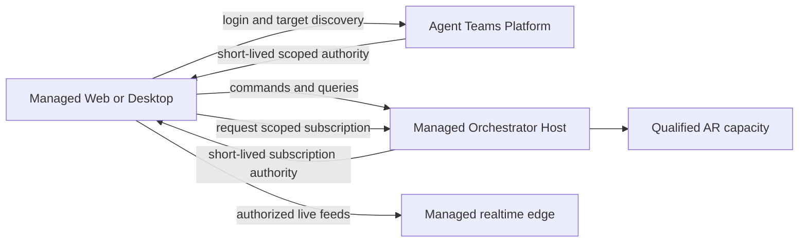

# Deployment Profiles

## Independent axes

Deployment, client, and execution placement are separate choices:

```text
Orchestrator deployment profile
  Managed SaaS | Standalone Self-Hosted | future Connected | future Fully Local

Client surface
  Web | Desktop | CLI | SDK consumer

Agent execution placement
  local device | customer worker | managed remote worker
```

No axis is inferred from another. Desktop is not automatically local authority,
Web is not automatically managed, and local AR execution does not mean that
orchestration state is local.

## Profile matrix

| Profile | Orchestrator authority | Product authority | Persistence | V1 | Clients |
|---|---|---|---|---|---|
| Managed SaaS | Agent Teams-managed Server Host | Managed Platform authority adapter | Managed PostgreSQL and server infrastructure | V1 target, qualification blocked | Managed Web, Desktop, CLI, SDK |
| Standalone Self-Hosted Server | Customer-operated Server Host | Standalone authority adapter | Customer PostgreSQL and server infrastructure | V1 target, qualification blocked | Co-deployed Web, Desktop, CLI, SDK |
| Connected Self-Hosted Server | Customer-operated Server Host | Standalone authority plus optional managed capabilities | Customer PostgreSQL and server infrastructure | Future, qualification deferred | Co-deployed Web, Desktop, CLI, SDK |
| Fully Local Desktop | Local Host on user device | Local standalone authority adapter | Context-owned SQLite and protected local components | Future, implementation deferred | Desktop, local CLI, SDK |

The Managed and Self-Hosted profiles use the same logical Orchestrator core and
public contracts. Composition validates one complete compatible adapter set. A
profile name never appears as a business-rule branch.

The reliability catalog is the machine-readable profile registry. `V1 target`
does not mean `qualified`: Managed and Standalone remain blocked by their listed
authority and persistence decisions. Connected Self-Hosted is a fourth
future profile in that registry even though it is not a V1 target.

Each profile binds exactly one product-authority adapter and an independent
commercial-authority mode. Managed Product Authority, Standalone Authority, and
Commercial Access Authority are separate logical ports even when one Platform
deployment implements more than one. Managed commercial access is optional and
qualified as a separate capability, so OD-037 cannot block baseline Managed SaaS.

Qualification is closed over mandatory capabilities. Managed and Standalone
require qualified `server-runtime-execution`; Fully Local requires qualified
`local-host-runtime-execution`. Optional `local-device-execution` and
`managed-commercial-entitlements` cannot be advertised until independently
qualified. The global qualification framework remains blocked by OD-039; an
accepted ADR plus an arbitrary file is not evidence.

## Managed SaaS topology

Managed SaaS means that an Orchestrator Host is running in Agent Teams-managed
infrastructure. The architecture permits local or remote agent execution, but a
placement is advertised only after its own connectivity conformance passes.



Platform is the managed product authority and control plane for customer
identity, tenancy, membership and grants, product-project binding, optional
commercial access, managed deployment placement, and target discovery. It does not own
Orchestrator Runs, Teams, Work, messages, Observation Evidence, Activity Views,
or diagnostic payload.

The normal data path does not proxy through Platform. After bootstrap, clients
connect directly to the scoped Orchestrator and realtime edge. Direct transport
does not bypass authority: the Host validates Platform-issued, audience-bound,
short-lived authority and current revocation requirements. Exact commercial
capability semantics remain open under OD-037.

Local-device execution behind a server Host is a separately gated deployment
capability, not a blocker for a server profile that has independently qualified
remote capacity.
OD-038 owns device enrollment, outbound connectivity, revocation, reconnect, and
custody. Until it passes, server profiles advertise only runtime placements whose
connectivity has independent qualification evidence.

## Standalone Self-Hosted topology

The customer deploys the Server Host, PostgreSQL, broker and realtime adapters,
and the Web UI from one supported release composition. A Standalone Authority
adapter replaces Platform identity and grant dependencies for baseline operation.

Self-hosted operation does not require Agent Teams-managed APIs, private package
registry access, or an active commercial connection unless the customer
explicitly enables a future connected managed capability.

The co-deployed Web UI uses the same origin or a release-qualified reverse-proxy
topology. Desktop can store an explicit named Target Profile for the server after
discovery, TLS, protocol, authority, and capability validation.

## Future Fully Local topology

Fully Local composes the future Local Host, context-owned SQLite adapters, local
workflow adapter, local realtime edge, and AR execution components under the
Local Supervisor. Components are independently signed and lifecycle-managed;
unused local infrastructure is not started merely because Desktop is installed.

ADR-0087 excludes this implementation from V1. OD-035 names OpenWorkflow as the
preferred local workflow spike candidate. Deferral cannot change public resource,
persistence port, workflow-state, feed, recovery, or authority boundaries.

## Connected and hybrid evolution

A customer-operated or future Local Host may later consume selected managed
identity, commercial, update, relay, or collaboration services while retaining
local orchestration state. That is a separate Connected Self-Hosted or Connected
Local profile, not Managed SaaS and not an implicit fallback.

Such a profile requires explicit data-flow, offline, revocation, licensing,
privacy, recovery, and degraded-mode decisions. It cannot be created merely by
letting a local Host call arbitrary Platform endpoints.

The baseline Standalone profile remains usable without Platform. A connected
commercial adapter may add selected capabilities, but lease expiry cannot block
cancellation, containment, recovery, deletion, or baseline access and export of
customer-owned data.

## Client Target Profiles

A Client Profile owns user-facing connection selection, not server state. It
contains safe target metadata and opaque credential references:

```text
profileId
displayName
targetId
targetKind
endpoint and discovery identity
authorityRealmRef
trustConfigurationRef
credentialRef
lastValidatedProtocol
lastKnownCapabilities
```

Target metadata cannot grant authorization. Secrets are resolved by the client
credential adapter. Capability snapshots are presentation hints and are
revalidated by the Host before commands.

Every client resource reference combines `TargetIdentity` with the public
resource reference. The active profile also owns a monotonically changing local
client generation. Switching profiles retires the old generation and closes or
discards its requests, subscriptions, cursors, caches, optimistic state,
operation handles, and late responses. These client fields never enter the
server-side Project Aggregate.

The first-use choices are Agent Teams Cloud, Connect to your server, and future
This device. Profiles are persistent and explicitly switched. Project identity
is bound to one Target; profile switching never migrates data, retries a command
against another Host, or duplicates a Run.

## Profile conformance

Every qualified profile proves:

- explicit authority and trust configuration;
- one writer and one process owner for every mutation and runtime process;
- public SDK behavioral compatibility for advertised capabilities;
- no silent adapter or target fallback;
- current authorization on command, query, feed resume, and raw data access;
- typed unsupported and degraded outcomes;
- target identity preserved across restart, update, and reconnect;
- stale client-target generations cannot update the active view;
- execution placement changes without changing Orchestrator target identity;
- every mandatory execution capability is independently qualified and no
  undeclared capability is advertised;
- advertised local-device execution passes OD-038 connectivity conformance;
- qualification evidence passes the OD-039 trusted attestation verifier;
- Managed authority and tenant isolation pass OD-012 before qualification;
- profile-specific backup, recovery, deletion, and operational readiness.
