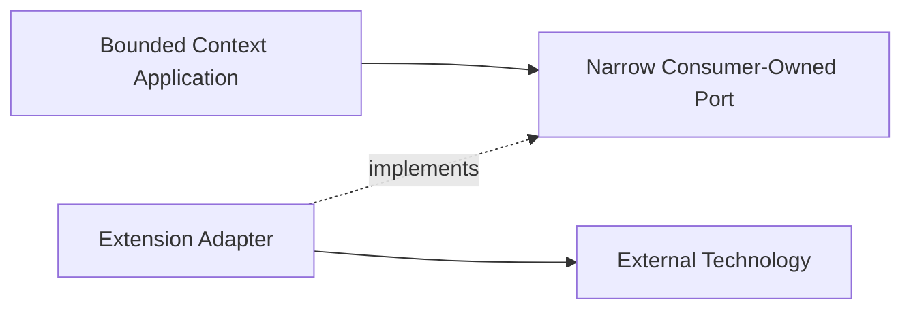

# Extension Points

Status: **Accepted placement rules; implementations deferred**

This document records where anticipated technologies and product capabilities
belong. It prevents future integrations from entering the wrong layer.

## Placement rules

An extension must use an existing port or introduce a narrow port owned by the
consuming application layer. Technology types stay in adapters. A plugin cannot
modify aggregate state except through an application use case.

## Temporal

Placement:

- workflow adapter for Run Orchestration;
- activities call application ports;
- signals and queries map to versioned application contracts;
- deterministic workflow code contains no domain model duplication.

Temporal owns durable workflow execution, timers, and activity retry mechanics.
Run Orchestration owns business retry, escalation, compensation, and completion
policy.

## LangGraph

LangGraph is an optional agent-local workflow engine. It belongs behind Runtime
Gateway, normally inside an `ar` worker/provider integration or a dedicated runtime
adapter.

The orchestrator observes normalized run state and events. It does not depend on
LangGraph graph nodes, checkpoints, Python runtime types, or provider session
internals. LangGraph cannot be assumed to resume an external Claude, Codex, or
OpenCode process unless the runtime driver provides that capability.

## External task boards

Jira, todo systems, and the existing desktop task board integrate through
Task Coordination ACL adapters. Task Coordination owns a consumer-facing
`TaskBoardPort`; each external system implements it through an adapter and
published mapping contracts.

The Task Coordination model remains canonical for orchestrator behavior. Adapters
own:

- external ID mappings;
- status and field translation;
- webhook or polling cursors;
- conflict and reconciliation state;
- provider-specific rate limits.

An external board must not become a repository implementation for the Task
aggregate without a separate consistency ADR.

## Agent-to-Agent protocols

A2A or future agent communication protocols belong in Messaging and Handoffs
inbound/outbound adapters. Protocol messages map to typed messages and handoffs.
Protocol identity and authorization pass through Identity and Access.

## MCP and tool surfaces

Runtime MCP/tool execution belongs in `ar` and provider drivers. The orchestrator
may own tool policy, approval intent, and auditable decisions through Policy and
Approvals, but it does not execute provider tools.

Slash commands are public command aliases or client conveniences. They must map to
versioned application commands and cannot bypass authorization or invariants.

## Observability and OpenTelemetry

OpenTelemetry belongs in the platform observability package and adapters.

Required boundaries:

- domain code emits domain facts, not OTel spans;
- application decorators create operation spans and metrics;
- adapters instrument transport, database, broker, and runtime calls;
- trace and correlation IDs propagate through commands and events;
- prompts, credentials, attachments, and provider payloads are redacted by
  default;
- telemetry is never authoritative business state.

Semantic conventions, sampling, retention, and exporters require a dedicated
decision before implementation.

## Memory

Shared agent memory is a future supporting subdomain, not a generic utility. A
memory capability requires explicit ownership of scope, retention, provenance,
forgetting, permissions, and consistency.

Until that model exists, contexts may use only their own state and published
contracts. A global mutable memory store is prohibited.

## Evaluation gates

Eval, review, and merge gates belong to Run Orchestration policy and application
ports. Evaluation engines are outbound adapters. Gate results are typed facts with
evidence references, not free-form booleans hidden in prompts.

## Plugin system

A future plugin system may register:

- inbound adapters;
- outbound adapters;
- policy implementations;
- projection builders;
- SDK middleware.

Plugins cannot deep-import context internals, replace an aggregate, write context
tables directly, or acquire runtime process ownership. Plugin manifests declare
capabilities, contract versions, permissions, and isolation requirements.

## Provider capability tiers

Lite, medium, and high tool modes are policy profiles, not provider branches in
the domain. Policy and Approvals selects a profile; Runtime Gateway translates the
profile into runtime capabilities supported by `ar`.
