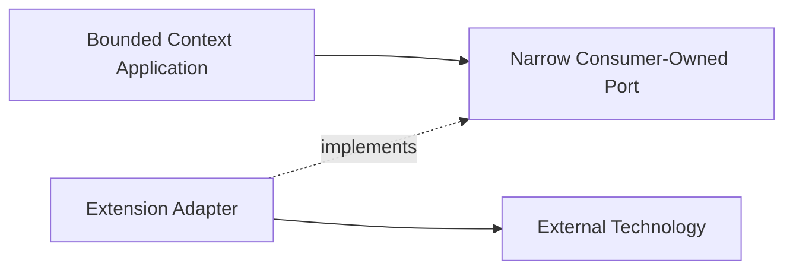

# Extension Points

This document records where anticipated technologies and product capabilities
belong. It prevents future integrations from entering the wrong layer.

## Placement rules

An extension must use an existing port or introduce a narrow port owned by the
consuming application layer. Technology types stay in adapters. A plugin cannot
modify aggregate state except through an application use case.

## Temporal

Placement:

- a Temporal client adapter implements narrow Run Orchestration scheduling ports;
- a Temporal Activity Worker is an inbound adapter that calls idempotent
  application use cases;
- signals and queries map through versioned workflow-boundary contracts;
- workflow definitions orchestrate deterministic application decisions without
  becoming domain aggregates;
- deterministic workflow code contains no domain model duplication.

Temporal owns durable workflow execution, timers, and activity retry mechanics.
Run Orchestration owns business retry, escalation, compensation, and completion
policy.

Run Orchestration persistence remains authoritative for business run state.
Temporal history is authoritative only for durable workflow execution. Activity
retries cannot bypass application idempotency, authorization, optimistic
concurrency, or aggregate invariants.

Feature-specific process managers use deterministic transitions, explicit
commands, durable timers, and idempotent effects. This is migration-friendly
design, not a requirement to reproduce Temporal history or implement a generic
workflow language locally.

The first Temporal workflow is a feature-specific Run Orchestration process
manager. Its business workflow ID is stable and scoped by tenant, run, process
kind, and explicit process generation. It never includes a contract, schema,
worker-build, or deployment version because a version change must not create a
second owner for the same process. Contract and build versions are pinned as
workflow metadata and deployment routing. An incompatible replacement requires a
durable successor handoff and fence under OD-005. Every mutating activity invokes
one narrow application command with a stable command ID, semantic fingerprint,
and expected revision or fence. Activity timeout, retry, and apparent success
never replace the application receipt because overlapping or unknown activity
outcomes are normal.

External clients do not signal or query Temporal directly. Product commands
commit through ordinary application inbound ports and publish outbox-backed
workflow notifications. Temporal signals are versioned adapter contracts with
notification identity and expected revision. Workflow queries expose scheduling
diagnostics; authoritative product queries read the application model.

Temporal cancellation remains cooperative. A workflow resolves product
cancellation through an idempotent application command, fences late completion,
and performs mandatory cleanup in a non-cancellable scope. Continue-as-new
carries compact scheduling state and opaque application references after measured
history thresholds.

Long-lived workflow releases retain representative histories for replay tests,
use pinned Worker Deployment behavior, and verify deployment-build registration
separately from process startup. A reconciliation worker classifies
application-ahead, Temporal-ahead, missing workflow, closed-workflow/active-run,
and unknown activity outcomes.

This accepted boundary covers Run Orchestration as the first Temporal consumer; it
does not make Run Orchestration the owner of other contexts' process managers. If
another bounded context later uses Temporal, that context owns its workflow
semantics and consumer-owned scheduling ports. Shared Temporal clients, workers,
and deployment tooling remain composition infrastructure.

## LangGraph

LangGraph is an optional agent-local workflow engine. It belongs behind the Runtime
ACL, normally inside an `ar` worker/provider integration or a dedicated runtime
adapter.

The orchestrator observes normalized run state and events. It does not depend on
LangGraph graph nodes, checkpoints, Python runtime types, or provider session
internals. LangGraph cannot be assumed to resume an external Claude, Codex, or
OpenCode process unless the runtime driver provides that capability.

## External task boards

Jira, todo systems, and the existing desktop task board integrate through
Work Coordination ACL adapters. Work Coordination owns a consumer-facing
`TaskBoardPort`; each external system implements it through an adapter and
published mapping contracts.

Jira, Notion, Discord, and other vendor connectors are excluded from v1 by
ADR-0074. Before the first one is implemented, OD-034 must resolve installation,
credential-reference, source-incarnation, webhook-cursor, raw deduplication, and
reconciliation ownership. A task-board ACL does not acquire those lifecycle
responsibilities merely because it translates Work semantics.

The Work Coordination model remains canonical for orchestrator behavior.
Work-facing ACL adapters own:

- external ID mappings;
- status and field translation;
- translation conflicts and semantic mapping revisions.

The future installation owner, if accepted, owns webhook or polling cursors, raw
deduplication, source continuity, connector health, and provider-specific rate
limits. Raw credentials remain behind a secret-provider adapter.

An external board must not become a repository implementation for the Task
aggregate without a separate consistency ADR.

## Agent-to-Agent protocols

A2A is an integration protocol spanning several orchestrator capabilities, not one
foreign domain model imported into Agent Communication:

- A2A `Message` maps through feature-owned Agent Communication adapters when it
  represents product dialogue;
- A2A `Task` is an external tracked interaction handle and maps through
  feature-owned Run Orchestration and Work Coordination adapters;
- A2A `contextId`, `taskId`, and artifact identifiers remain external ACL bindings,
  never aliases for `ConversationId`, internal Task or Work identity,
  `OrchestrationRunId`, or artifact identity;
- A2A task status is external execution evidence. It cannot directly change
  internal Work lifecycle;
- work handoff and acceptance remain Work Coordination semantics;
- protocol identity and authorization pass through the configured product
  authority provider and feature-owned authorization ports before binding lookup
  or domain commands.

An A2A gateway may share codecs, protocol-version negotiation, streaming, push
delivery, and conformance fixtures. Feature-owned mappings still call narrow
application ports in their owning contexts. The gateway owns no Work, Run,
Conversation, or authorization state.

## Agent Client Protocol

ACP connects a coding agent runtime to an editor or client environment. Its
sessions, terminal/tool interactions, filesystem capabilities, and provider
execution semantics belong to AR and an AR-owned protocol adapter.

The orchestrator may request provider-neutral runtime capabilities and consume
normalized observations through consumer-owned ports implemented by the
stateless Runtime ACL. It does not import ACP
messages, sessions, task state, transport DTOs, or editor lifecycle into Work,
Run, Conversation, or the public orchestrator SDK. An ACP task-like operation is
runtime evidence, not an internal Task or `WorkExecution`.

ACP and A2A are independent extension points: ACP is runtime/client integration
behind AR, while A2A enters feature-owned orchestrator ACLs.

## MCP and tool surfaces

Runtime MCP/tool execution belongs in `ar` and provider drivers. The orchestrator
may own tool policy and auditable risk decisions through Policy and Risk, and
approval lifecycle through Approval Management, but it does not execute provider
tools.

Coordination MCP is different from runtime tool execution. Team communication,
Work commands, Run observation, inbox queries, and other product coordination
tools are inbound adapters over their owning orchestrator application ports. One
app-owned backend in the Orchestrator Host remains authoritative; lightweight
stdio shims may translate MCP transport but own no controller, product state,
repository, process lifecycle, or cross-feature policy.

Every coordination tool maps through the same validation, authenticated scope,
authorization, idempotency, and application command as SDK or Connect callers.
An MCP process cannot access another bounded context's database or create a
parallel product mailbox.

Slash commands are public command aliases or client conveniences. They must map to
versioned application commands and cannot bypass authorization or invariants.

## Observability and OpenTelemetry

OpenTelemetry has two distinct integration roles:

- platform observability for traces, metrics, logs, correlation, and operational
  diagnostics;
- feature-owned usage ingestion or export adapters when OpenTelemetry carries
  provider-neutral consumption observations.

The roles may share low-level SDK setup but never a domain model or source-of-truth
assumption. Sampled or lossy telemetry is not authoritative usage accounting.

Required boundaries:

- domain code emits domain facts, not OTel spans;
- application decorators create operation spans and metrics;
- adapters instrument transport, database, broker, and runtime calls;
- trace and correlation IDs propagate through commands and events;
- prompts, credentials, attachments, and provider payloads are redacted by
  default;
- telemetry is never authoritative business state.

Semantic conventions, sampling, retention, and exporters require a dedicated
decision before implementation.

## Memory

Shared agent memory is a future supporting subdomain, not a generic utility. A
memory capability requires explicit ownership of scope, retention, provenance,
forgetting, permissions, and consistency.

Until that model exists, contexts may use only their own state and published
contracts. A global mutable memory store is prohibited.

## Evaluation gates

Eval, review, and merge gates belong to explicit Run Orchestration or Work
Coordination policies according to which lifecycle they guard. Evaluation engines
are outbound adapters. Gate results are typed facts with evidence references, not
free-form booleans hidden in prompts.

## Plugin system

A future plugin system may register:

- inbound adapters;
- outbound adapters;
- explicitly extensible application strategies and external policy-engine adapters;
- projection builders;
- SDK middleware.

Plugins cannot deep-import context internals, replace an aggregate, write context
tables directly, or acquire runtime process ownership. Plugin manifests declare
capabilities, contract versions, permissions, and isolation requirements.

Plugins cannot replace domain policies that protect aggregate invariants. Facts
returned by a plugin remain untrusted input until the owning application and domain
validate them.

### Non-negotiable extension guardrails

These constraints apply to built-in, private first-party, community, and custom
extensions. Distribution or publisher ownership does not weaken them.

- There is no global `PluginManager` that resolves arbitrary application
  services. Composition may own installation and lifecycle coordination, but it
  cannot become a service locator or acquire business semantics.
- Plugin code is never invoked inside a database transaction or Unit of Work.
  The application records durable intent before an external effect, and unknown
  outcomes are reconciled instead of retried blindly.
- Registration or discovery order never defines business priority, ownership,
  routing, or conflict resolution. An owning feature contract defines those
  semantics explicitly; otherwise duplicate providers fail closed.
- Manifest permissions are requests, not grants. Effective authority is the
  intersection of the declared requirement, installation consent, current
  authorization and policy, deployment qualification, and runtime enforcement.
- Commercial entitlement, product authorization, and technical capability
  enforcement remain independent decisions. None implies either of the others.
- Logical extension identity, publisher identity, artifact digest, installation
  identity, source incarnation, and active runtime generation remain distinct.
- Mutable tags such as `latest` may assist discovery but never identify an
  installed or active artifact. Installation, activation, rollback, and audit
  pin immutable digests and resolved contract versions.
- A timeout or lost acknowledgement after a potentially accepted external effect
  enters reconciliation. Automatic retry is allowed only with a proven
  idempotency contract or authoritative evidence that the effect did not occur.
- Uninstalling an extension does not implicitly delete user or bounded-context
  data. Data export, retention, transfer, and erasure use an explicit
  owner-controlled disposition process.
- A public SPI is not published from one implementation. It requires at least
  two independently exercised implementations, stable ownership, compatibility
  fixtures, and a conformance suite proving substitutability without shared
  internals.

The shared extension foundation, artifact distribution, and catalog boundary
remain open in OD-041. The Web and Desktop contribution model remains an
unapproved proposal in OD-042. Neither open decision authorizes implementation
or publication of a public SPI.

## Provider capability tiers

Lite, medium, and high tool modes are policy profiles, not provider branches in
the domain. Policy and Risk selects a profile; the Runtime ACL translates the
profile into runtime capabilities supported by `ar`.
