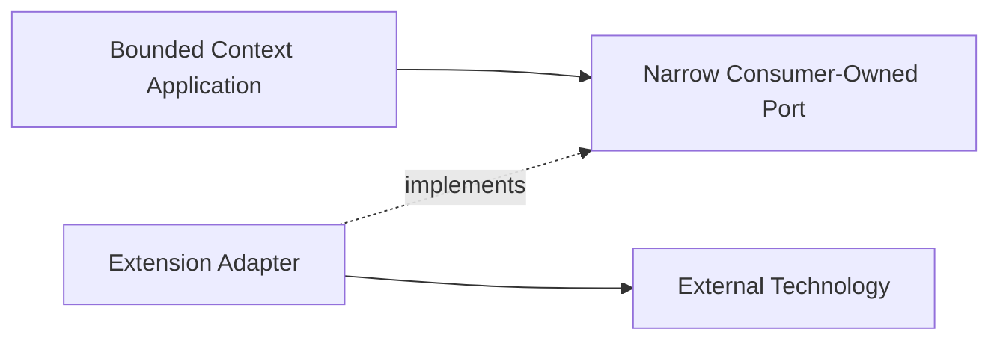

# Extension Points

This document records where anticipated technologies and product capabilities
belong. It prevents future integrations from entering the wrong layer.

## Placement rules

An extension must use an existing port or introduce a narrow port owned by the
consuming application layer. Technology types stay in adapters. A plugin cannot
modify aggregate state except through an application use case.

## Temporal

Placement:

- a Temporal client adapter implements narrow Run Orchestration scheduling ports;
- a Temporal Activity Worker is an inbound adapter that calls idempotent
  application use cases;
- signals and queries map through versioned workflow-boundary contracts;
- workflow definitions orchestrate deterministic application decisions without
  becoming domain aggregates;
- deterministic workflow code contains no domain model duplication.

Temporal owns durable workflow execution, timers, and activity retry mechanics.
Run Orchestration owns business retry, escalation, compensation, and completion
policy.

Run Orchestration persistence remains authoritative for business run state.
Temporal history is authoritative only for durable workflow execution. Activity
retries cannot bypass application idempotency, authorization, optimistic
concurrency, or aggregate invariants.

Feature-specific process managers use deterministic transitions, explicit
commands, durable timers, and idempotent effects. This is migration-friendly
design, not a requirement to reproduce Temporal history or implement a generic
workflow language locally.

The first Temporal workflow is a feature-specific Run Orchestration process
manager. Its workflow ID is stable and scoped by tenant, run, process kind, and
workflow-contract version. Every mutating activity invokes one narrow application
command with a stable command ID, semantic fingerprint, and expected revision or
fence. Activity timeout, retry, and apparent success never replace the
application receipt because overlapping or unknown activity outcomes are normal.

External clients do not signal or query Temporal directly. Product commands
commit through ordinary application inbound ports and publish outbox-backed
workflow notifications. Temporal signals are versioned adapter contracts with
notification identity and expected revision. Workflow queries expose scheduling
diagnostics; authoritative product queries read the application model.

Temporal cancellation remains cooperative. A workflow resolves product
cancellation through an idempotent application command, fences late completion,
and performs mandatory cleanup in a non-cancellable scope. Continue-as-new
carries compact scheduling state and opaque application references after measured
history thresholds.

Long-lived workflow releases retain representative histories for replay tests,
use pinned Worker Deployment behavior, and verify deployment-build registration
separately from process startup. A reconciliation worker classifies
application-ahead, Temporal-ahead, missing workflow, closed-workflow/active-run,
and unknown activity outcomes.

This accepted boundary covers Run Orchestration as the first Temporal consumer; it
does not make Run Orchestration the owner of other contexts' process managers. If
another bounded context later uses Temporal, that context owns its workflow
semantics and consumer-owned scheduling ports. Shared Temporal clients, workers,
and deployment tooling remain composition infrastructure.

## LangGraph

LangGraph is an optional agent-local workflow engine. It belongs behind the Runtime
ACL, normally inside an `ar` worker/provider integration or a dedicated runtime
adapter.

The orchestrator observes normalized run state and events. It does not depend on
LangGraph graph nodes, checkpoints, Python runtime types, or provider session
internals. LangGraph cannot be assumed to resume an external Claude, Codex, or
OpenCode process unless the runtime driver provides that capability.

## External task boards

Jira, todo systems, and the existing desktop task board integrate through
Work Coordination ACL adapters. Work Coordination owns a consumer-facing
`TaskBoardPort`; each external system implements it through an adapter and
published mapping contracts.

The Work Coordination model remains canonical for orchestrator behavior. Adapters
own:

- external ID mappings;
- status and field translation;
- webhook or polling cursors;
- conflict and reconciliation state;
- provider-specific rate limits.

An external board must not become a repository implementation for the Task
aggregate without a separate consistency ADR.

## Agent-to-Agent protocols

A2A or future agent communication protocols belong in Agent Communication
inbound/outbound adapters. Protocol messages map to typed messages. Work handoff
semantics remain in Work Coordination. Protocol identity and authorization pass
through Identity Registry and Access Control.

## MCP and tool surfaces

Runtime MCP/tool execution belongs in `ar` and provider drivers. The orchestrator
may own tool policy and auditable risk decisions through Policy and Risk, and
approval lifecycle through Approval Management, but it does not execute provider
tools.

Slash commands are public command aliases or client conveniences. They must map to
versioned application commands and cannot bypass authorization or invariants.

## Observability and OpenTelemetry

OpenTelemetry belongs in the platform observability package and adapters.

Required boundaries:

- domain code emits domain facts, not OTel spans;
- application decorators create operation spans and metrics;
- adapters instrument transport, database, broker, and runtime calls;
- trace and correlation IDs propagate through commands and events;
- prompts, credentials, attachments, and provider payloads are redacted by
  default;
- telemetry is never authoritative business state.

Semantic conventions, sampling, retention, and exporters require a dedicated
decision before implementation.

## Memory

Shared agent memory is a future supporting subdomain, not a generic utility. A
memory capability requires explicit ownership of scope, retention, provenance,
forgetting, permissions, and consistency.

Until that model exists, contexts may use only their own state and published
contracts. A global mutable memory store is prohibited.

## Evaluation gates

Eval, review, and merge gates belong to explicit Run Orchestration or Work
Coordination policies according to which lifecycle they guard. Evaluation engines
are outbound adapters. Gate results are typed facts with evidence references, not
free-form booleans hidden in prompts.

## Plugin system

A future plugin system may register:

- inbound adapters;
- outbound adapters;
- explicitly extensible application strategies and external policy-engine adapters;
- projection builders;
- SDK middleware.

Plugins cannot deep-import context internals, replace an aggregate, write context
tables directly, or acquire runtime process ownership. Plugin manifests declare
capabilities, contract versions, permissions, and isolation requirements.

Plugins cannot replace domain policies that protect aggregate invariants. Facts
returned by a plugin remain untrusted input until the owning application and domain
validate them.

## Provider capability tiers

Lite, medium, and high tool modes are policy profiles, not provider branches in
the domain. Policy and Risk selects a profile; the Runtime ACL translates the
profile into runtime capabilities supported by `ar`.
