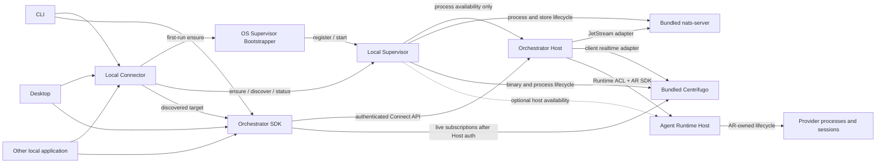

# Local Host Lifecycle

## Purpose

This boundary makes the durable local orchestrator as easy to use as a normal CLI
while keeping process availability outside orchestration business behavior.

`Local Supervisor` and `Orchestrator Host` are platform and application roles,
not bounded contexts. Full tactical DDD belongs inside business bounded contexts;
inventing aggregates for process discovery or binary activation is prohibited.

ADR-0033 is the current lifecycle authority: one shared per-user Local Supervisor
is the sole owner of local Host process availability. Desktop, CLI, and other
clients may bootstrap and discover it, but they never directly supervise a Host.
ADR-0030 remains authoritative only for the separate local and hosted composition
profiles. ADR-0060 proposes making that precedence explicit in ADR history.

## Process topology



The Supervisor is not on the normal SDK request path. After discovery and
handshake, clients connect directly to the Host public control API.

The SDK obtains an opaque realtime subscription descriptor and short-lived token
from the Host through Connect. Token refresh and feed authorization also return
to the Host. The Local Connector and Supervisor never issue subscription tokens,
select channels, or proxy live publications.

## Responsibility matrix

| Responsibility | Owner |
|---|---|
| Domain policy, commands, queries, runs, and process managers | Owning bounded context in Orchestrator Host |
| UoW, inbox, outbox, projections, and reconciliation | Orchestrator Host and owning feature |
| Public control behavior and SDK capability negotiation | Orchestrator Host |
| Local component discovery and process availability | Local Supervisor |
| Version staging, activation lock, health, and bounded restart | Local Supervisor |
| Local NATS process, binary, store path, lifetime lock, and resource lifecycle | Local Supervisor |
| JetStream topology, publish, consume, ACK, and transport mapping | JetStream adapters |
| Event ordering, delivery, privacy, retention, and replay requirements | Owning feature contract |
| Local Centrifugo binary, endpoint, process health, staged activation, and cleanup | Local Supervisor |
| Realtime channel mapping, token encoding, publication projection, and recovery signaling | Centrifugo adapter |
| Durable client feed, cursor, snapshot, feed-scope validation, and classification | Owning feature |
| Product grant, delegation, revocation, and authorization decision | Access Control |
| AR host availability when locally managed | Local Supervisor |
| Runtime sessions, AR execution identity and custody, provider processes, sandbox, and permission enforcement | Agent Runtime |
| User defaults for target and scope | Client Profile |
| Team project directory or execution workspace identity | Workspace Registry |

Sharing a low-level process or connection does not transfer semantic ownership.

## Two control paths

### Bootstrap control

If the Supervisor is absent, an idempotent OS-specific bootstrapper in the local
application composition registers or starts it. This bootstrapper is not part of
the ordinary SDK. Concurrent first-run clients converge through a protected
interprocess lifecycle lock and cannot install or start competing Supervisors.

After Supervisor readiness, the Local Connector uses a narrow protocol for:

- `ensure` the default or explicitly selected local target;
- `discover` the active Host endpoint and instance metadata;
- `status`, `doctor`, `drain`, and explicit administrative update operations.

This protocol exposes no team, task, run, message, or approval operation. Ordinary
SDK packages do not install, start, stop, or update components. A product CLI may
compose the SDK with a separate local-host administration client.

The first implementation milestone is deliberately limited to idempotent
bootstrap, `ensure`, `discover`, readiness/health, and typed diagnostics. Automatic
updates, staged activation, rollback, drain, garbage collection, and full
service-manager recovery remain target capabilities governed by OD-021; they are
not prerequisites for the first local vertical slice.

The default Desktop package includes pinned platform builds of managed local
components. It does not download Centrifugo on first launch. The release pipeline
verifies provenance and checksum, applies nested platform signing and
notarization, and stages the binary beside the Host. The Supervisor starts the
memory-engine profile on a protected rotating endpoint. Users install, configure,
or start nothing manually.

Bootstrap, discovery, and administration remain narrow capability surfaces even
if they share one low-level protected connection. Exact public TypeScript names
are deferred, but one broad process-control interface is prohibited.

### Public control

After discovery, the SDK performs an authenticated handshake with the Host and
uses the same versioned Connect control API as other supported clients. Local
transport may remove network exposure, but it cannot bypass authorization,
validation, idempotency, scoping, capability negotiation, or error mapping.

Selection is deterministic. A failed remote target never silently falls back to a
local target, and an unavailable local target never silently selects another
profile.

## Identity and discovery

Keep these identities distinct:

```text
TargetId
SupervisorInstanceId
HostInstanceId
HostBootGeneration
ComponentVersion
```

The stable locator names a trusted local deployment scope. It does not identify
one Host process. A successful discovery result is bound to the active Supervisor
instance, Host instance, boot generation, endpoint, protocol range, capabilities,
and expiry or liveness evidence.

The stable locator contains no Host bearer credential. A per-boot Host credential
is delivered only through the protected Supervisor discovery channel and rotates
with Host identity and endpoint. It never enters argv, inherited environment,
project configuration, or renderer-visible state.

PID, port, socket pathname, and executable pathname are diagnostics, not
authority. A stale locator or endpoint is removed only after ownership and
liveness checks. A foreign live process is never killed or adopted.

Locator replacement uses a temporary owner-only file, file `fsync`, atomic
rename, and parent-directory `fsync`. Truncated, malformed, schema-invalid, stale,
and foreign-identity locators produce distinct typed outcomes. A responsive
foreign endpoint is never unlinked, killed, or adopted.

Durable state and endpoint roots are app owned and private. The implementation
rejects symlink substitution, unexpected file types, and group/world-writable
state before use. Unix-domain socket paths use a short private runtime root rather
than inheriting the potentially long durable data path.

The exact cardinality of Supervisors and local targets, locator representation,
bootstrap credential exchange, and OS-specific endpoint substrate remain in
OD-001 and OD-021.

## Target, profile, and workspace

`Target`, `Client Profile`, and `Workspace` are independent:

```text
Client Profile
  -> selects Target
  -> supplies optional default tenant/project scope

Target
  -> identifies deployment endpoint and trust configuration

Workspace
  -> domain resource inside a project
  -> never controls deployment endpoint or credentials
```

A local Host identity is scoped by installation and data ownership, not by the
current directory, project, workspace, terminal, or client process. Multiple
profiles may reference the same target.

Project-controlled files cannot replace target endpoints, lower trust, select
credentials, or trigger installation. This prevents opening an untrusted
repository from redirecting the CLI to another control plane.

## CLI behavior

For a normal local command, the CLI:

1. resolves one explicit or default Client Profile and Target;
2. bootstraps the Supervisor only when the selected local target requires it;
3. asks the Supervisor to ensure and discover a compatible Host;
4. validates instance identity, protocol range, capabilities, and trust;
5. invokes the Host through the ordinary SDK;
6. detaches on `Ctrl+C` without cancelling accepted durable work.

Remote targets skip local bootstrap entirely. Failure never silently changes the
selected target.

A compatible active Host is reused even when a newer component is available. An
ordinary command does not kill or replace it. An incompatible client receives a
typed outcome with actionable version information. Only explicit privileged
administration may initiate drain and activation.

Operational commands such as `host status`, `host version --json`, `host doctor`,
`host drain`, and `host update` are served by the narrow local-host administration
client. Exact command names remain product-level design, but machine-readable
status, bounded waits, and typed degraded states are required.

## Lifecycle invariants

- Concurrent `ensure` calls converge on one compatible active Host per local
  target.
- The Supervisor serializes start, drain, activate, stop, and recovery transitions.
- Bootstrap election, Supervisor lifetime ownership, and managed-store lifetime
  ownership are separate locks with separate failure and stale-recovery rules.
- The Supervisor holds the external exclusive lock for every managed NATS store
  for the complete broker-process lifetime.
- Readiness requires authenticated protocol and capability negotiation, not only a
  listening port.
- Restart is bounded and classified; crash loops become a typed degraded state.
- Client connection counts never determine Host lifetime.
- `Ctrl+C`, terminal closure, Desktop exit, and SDK cleanup detach the client only.
- Explicit foreground or ephemeral mode never adopts or mutates the durable
  target's store accidentally.
- The Supervisor does not inspect or repair bounded-context tables.
- The Host does not replace its own executable or become its own availability
  supervisor.

## Drain and activation

Storage migration rollback, compatibility windows, mixed-version behavior,
activation failure, and service-manager fallback require the detailed state
machine in OD-021. Implementations must not invent these policies independently.

A staged Host activation follows this visibility protocol:

1. acquire the short bootstrap/update election;
2. stage and verify the immutable candidate release;
3. durably record pending activation;
4. start the candidate on a unique boot-scoped endpoint without mutation
   authority;
5. require identity, protocol, capability, and readiness attestation;
6. quiesce the previous Host: reject new mutations, complete bounded in-flight
   Units of Work, and commit command, inbox, and outbox state;
7. atomically replace the stable locator with the selected Host generation, then
   allow only that generation to accept new mutations;
8. keep the previous Host alive but mutation-fenced for a bounded
   stabilization/rollback window;
9. drain remaining transport work and stop the previous Host only after the
   selected candidate remains healthy;
10. commit activation state, remove pending state durably, and reconcile with AR
    and JetStream before full readiness.

The locator swap is the client-visibility pivot, not a substitute for Host
mutation fencing. Existing clients may still hold the previous endpoint, so that
Host must already be quiesced before the selected candidate accepts mutations.
Before the pivot, recovery retains the previous Host and removes an unselected
candidate. After it, recovery either proves the selected generation healthy,
fences it and atomically restores the previous locator while the previous Host is
still available, or reports that the rollback target is unavailable. At no point
may both generations accept mutations.

## Local and hosted parity

Local and hosted compositions share domain, application, public control, runtime
ACL, and JetStream adapter semantics. They differ only at deployment adapters:

```text
Local:
  Local Supervisor + Orchestrator Local + SQLite + managed NATS
  + managed Centrifugo memory profile

Hosted:
  platform supervisor + Orchestrator Server + PostgreSQL + external NATS
  + managed Centrifugo clustered profile
```

The hosted platform supervisor does not become a business service, just as the
Local Supervisor is not a bounded context.

Hosted composition may run multiple Centrifugo nodes with a Redis-compatible
engine for connection fanout and short recovery history. Local composition uses
one memory-engine process. Both profiles use the same realtime adapter contract,
while SQL feeds and Connect reconciliation remain authoritative.

## Security boundaries

- Local bootstrap and Host endpoints are never wildcard-bound.
- Local trusted roots, locator files, locks, credentials, and socket paths are
  owner-only and reject symlink or unsafe-permission substitution.
- Secrets are not passed through argv, project configuration, renderer IPC, or a
  shared plaintext locator.
- Desktop renderer uses a narrow validated bridge and receives no lifecycle
  authority.
- Host and Supervisor authenticate instance and protocol generation before trust.
- Administrative lifecycle capability is separate from normal SDK credentials.
- Logs and diagnostics expose safe identifiers, never bootstrap capabilities.

OD-001 selects the exact Unix socket, Windows named-pipe, or protected loopback
combination.

## Prohibited coupling

Do not:

- import business contexts into the Supervisor;
- put process installation or update logic in the SDK;
- route normal commands through the Supervisor;
- let JetStream subjects or NATS lifecycle enter domain/application code;
- let Centrifugo channels, positions, tokens, or errors enter
  domain/application or public SDK models;
- let Centrifugo or the Supervisor own feed, authorization, publication, or
  recovery semantics;
- let the Supervisor or Host control provider processes outside AR;
- use workspace configuration as deployment or trust configuration;
- branch domain behavior on local, desktop, hosted, or foreground mode.
