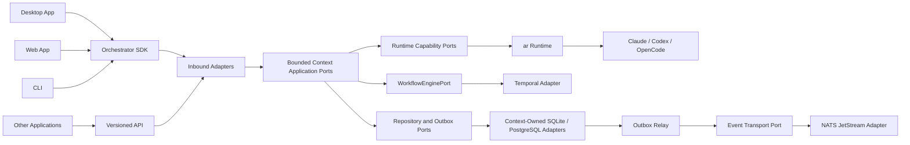

# Architecture Overview

Status: **Accepted baseline**

## Purpose

Agent Teams Orchestrator is a headless control plane for coordinating teams of
software agents. It owns product-level coordination and delegates agent execution
to a provider-neutral runtime.

The architecture must support:

- desktop, web, CLI, automation, and third-party clients;
- local and hosted deployment;
- Claude, Codex, OpenCode, and future providers through `ar`;
- durable commands, retries, recovery, and replayable integration events;
- future Temporal workflows without coupling the domain to Temporal;
- future extraction of bounded contexts into services.

## Architectural style

The system is an event-driven modular monolith built with:

- Clean Architecture dependency direction;
- Hexagonal Architecture ports and adapters;
- feature-owned vertical slices;
- strategic and tactical Domain-Driven Design;
- selective CQRS read models;
- transactional outbox and idempotent inbox processing;
- strict versioned contracts.

It starts as a modular monolith because a single deployment and transaction
boundary is easier to operate and verify. Bounded contexts remain extraction-ready
without paying the operational cost of premature microservices.

## Control plane versus runtime

The orchestrator decides:

- what team should exist;
- what work should be performed;
- who owns a task;
- which dependencies block progress;
- when to send, queue, retry, escalate, or complete work;
- what desired runtime state should be requested.

The runtime decides and enforces:

- how a provider session is created and resumed;
- how agent processes are supervised;
- how cancellation and recovery are performed;
- how credentials, leases, fencing, sandboxing, and workspace isolation work;
- how provider events become normalized runtime events.

The boundary is detailed in [Runtime boundary](runtime-boundary.md).

## Deployment model

The same core supports multiple compositions:

- **Desktop sidecar**: the desktop application starts and monitors a local
  orchestrator service automatically.
- **Hosted service**: web and remote clients connect to a server deployment.
- **Embedded testing composition**: tests use in-memory adapters and a fake
  runtime without launching real agents.

Deployment mode must not change domain behavior.

## Persistence model

Aggregate repositories hold authoritative business state. Commands update state
and append outbox records in one transaction. Integration-event publishers relay
outbox records to the configured transport.

The initial design is not event sourced. Event journals support audit, diagnostics,
replay of projections, and simulation. Making events the authoritative source of
aggregate state requires a separate ADR.

Persistence is context-owned. Platform persistence packages may provide drivers,
transaction primitives, migration tooling, and test harnesses, but they do not own
context repositories, tables, migrations, inboxes, outboxes, or projections.

## Scope and access

Every team, task, orchestration run, message, and runtime binding belongs to one
project. Workspace registrations belong to that project and are referenced by
opaque workspace identities rather than arbitrary paths.

Authentication may be delegated to an external identity provider. Authorization,
tenant membership, project membership, and machine-client access require an
explicit orchestrator boundary and must be enforced before application use cases
execute. The exact Identity and Access context remains part of context-map
validation.

## Read models

Write-side bounded contexts own their context-local projections. A query-composition
adapter may join published read models for a client view, but it does not become an
owner of business state and cannot write context storage.

## Evolution to services

A bounded context may be extracted when there is demonstrated need for independent
scaling, ownership, security, or deployment. Extraction should replace an in-process
adapter with a transport adapter while preserving domain and application behavior.

Extraction readiness requires:

- no deep imports across bounded contexts;
- versioned integration contracts;
- context-owned persistence;
- idempotent consumers;
- explicit consistency expectations;
- no cross-context database transactions.

The initial context map remains proposed until it is validated against concrete
use cases, current desktop behavior, event-storming scenarios, and concurrency
boundaries.

## Non-goals

The first implementation does not aim to:

- build a general-purpose workflow language;
- replace `ar` provider execution;
- make Temporal or NATS part of the domain model;
- expose internal aggregates directly through an SDK;
- migrate all existing desktop task-board code immediately;
- implement every future provider before one vertical slice is proven.
