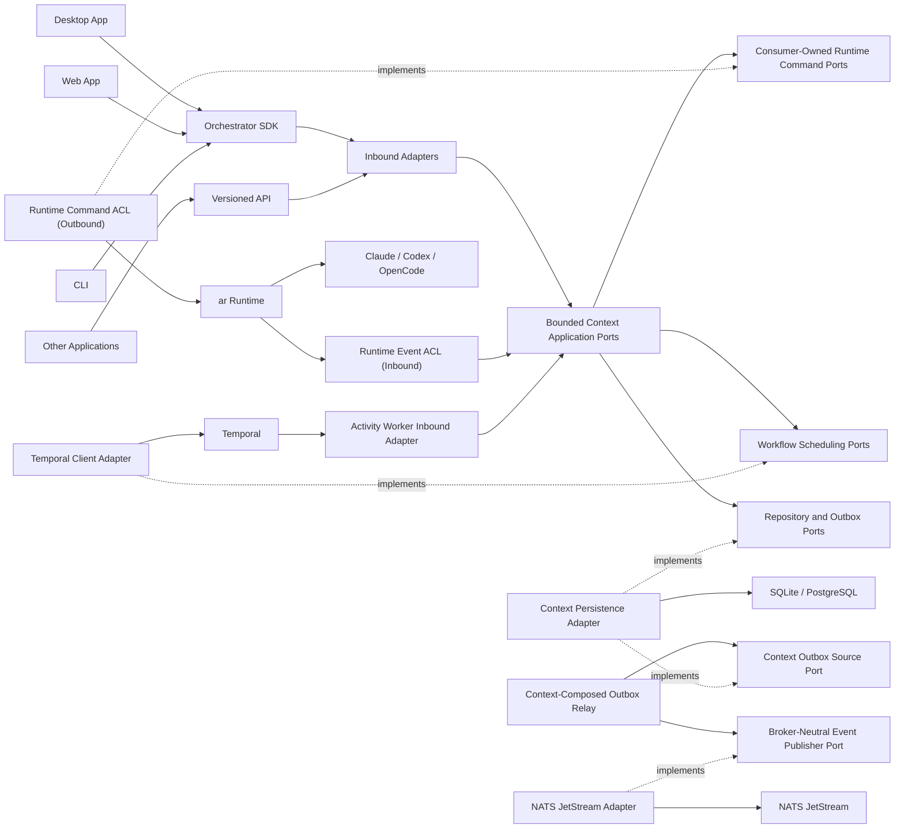

# Architecture Overview

## Purpose

Agent Teams Orchestrator is a headless control plane for coordinating teams of
software agents. It owns product-level coordination and delegates agent execution
to a provider-neutral runtime.

The architecture must support:

- desktop, web, CLI, automation, and third-party clients;
- local and hosted deployment;
- Claude, Codex, OpenCode, and future providers through `ar`;
- durable commands, retries, recovery, and integration events with
  contract-declared retention and replay semantics;
- future Temporal workflows without coupling the domain to Temporal;
- future extraction of bounded contexts into services.

## Architectural style

The system is an event-driven modular monolith built with:

- Clean Architecture dependency direction;
- Hexagonal Architecture ports and adapters;
- domain-capability feature slices inside focused bounded contexts;
- strategic and tactical Full Domain-Driven Design;
- selective CQRS read models;
- transactional outbox and idempotent inbox processing;
- strict versioned contracts.

It starts as a modular monolith because one deployment is easier to operate and
verify. Each bounded context keeps its own local transaction boundary even when
contexts share one physical database server. Bounded contexts remain
extraction-ready without paying the operational cost of premature microservices.

## Control plane versus runtime

The orchestrator decides:

- what team should exist;
- what work should be performed;
- who owns a task;
- which dependencies block progress;
- when to send, queue, retry, escalate, or complete work;
- what desired runtime state should be requested.

Workspace Registry owns execution-workspace allocation and materialization through
replaceable worktree, clone, snapshot, or remote-workspace adapters.

The runtime decides and enforces:

- how a provider session is created and resumed;
- how agent processes are supervised;
- how cancellation and recovery are performed;
- how credentials, leases, fencing, sandboxing, mounts, process isolation, and
  network restrictions work;
- how provider events become normalized runtime events.

The boundary is detailed in [Runtime boundary](runtime-boundary.md).

## Deployment model

The same core supports multiple compositions:

- **Local Supervisor**: a small per-user technical deployment-control process. It
  ensures, discovers, monitors, drains, and activates versioned local components.
  It owns no orchestration behavior and is not on the normal SDK request path.
- **Orchestrator Local**: a versioned local Host composition with protected local
  control, SQLite, local runtime integration, and the JetStream adapter. CLI,
  Desktop, and other local applications share it through the SDK.
- **Orchestrator Server**: a hosted deployable artifact with network control,
  PostgreSQL, hosted identity/tenancy, and JetStream adapters.
- **Embedded testing composition**: tests use in-memory adapters and a fake
  runtime without launching real agents.

The local and server artifacts are thin composition roots, not separate product
implementations. Deployment mode must not change domain behavior.

The shared per-user Local Supervisor is the only local process-lifecycle owner.
Desktop, CLI, and other applications bootstrap or discover it and then connect to
the Host; they do not supervise their own Host sidecars. ADR-0060 removes the
remaining historical ambiguity in ADR-0030.

One bounded context has one authoritative persistence profile in a running
deployment. A Desktop using Orchestrator Server does not keep a second local
business write model; any local cache is disposable. Moving context state between
profiles is a versioned logical transfer, never generic SQLite/PostgreSQL table
synchronization.

Normal local use is zero-touch. The Local Supervisor manages the bundled
`nats-server` process and physical store lifecycle; the Host's JetStream adapters
own broker interaction. It may supervise AR host availability, but AR remains the
only owner of provider sessions and processes. See
[Local Host Lifecycle](local-host-lifecycle.md).

Client configuration distinguishes:

- a `Target`, which identifies one concrete deployment and trust boundary;
- a `Client Profile`, which selects a target and optional default scope;
- a `Workspace`, which is a project-owned domain resource.

Workspace or project configuration cannot redirect a client, choose credentials,
or lower target trust. Durable work always survives client exit. Attached CLI
work uses an explicit client-bound Run sponsorship whose clean exit or fenced
expiry requests business cancellation without stopping shared infrastructure.

## Persistence model

Aggregate repositories hold authoritative business state. Commands update state
and append required integration-event outbox and durable command-dispatch records
in one transaction. Relays deliver those records after commit through their
respective contracts.

The initial design is not event sourced. Event journals support audit, diagnostics,
and simulation. Projection replay is supported only for contracts whose
completeness, retention, upcasting, privacy, and replay authorization make that
guarantee explicit. Making events the authoritative source of aggregate state
requires a separate ADR.

Persistence is context-owned. Platform persistence packages may provide drivers,
transaction primitives, migration tooling, and test harnesses, but they do not own
context repositories, tables, migrations, inboxes, outboxes, or projections.

A transaction changes authoritative state in one bounded context only. Cross-context
effects use integration events and process managers even when all contexts use the
same application process or PostgreSQL cluster.

## Scope and access

Every team, task, orchestration run, message, and runtime binding belongs to one
project. Workspace registrations belong to Workspace Registry and are referenced
by opaque workspace identities rather than arbitrary paths.

Authentication may be delegated to an external identity provider. Inbound adapters
authenticate and establish a principal. Access Control provides membership and
grant facts. Every application use case authorizes its business operation before
mutating or disclosing state; domain behavior enforces identity-dependent
invariants from explicit facts.

The public control plane uses feature-owned Protobuf through Connect and compatible
gRPC adapters. Integration events use separate feature-owned JSON Schemas. The
handwritten SDK maps local-Host and hosted Connect targets to one behavioral
surface without exposing generated wire messages. An in-process backend exists
only in the embedded test composition and is not a production SDK mode.

## Read models

Write-side bounded contexts own their context-local projections. A query-composition
adapter may join published read models for a client view, but it does not become an
owner of business state and cannot write context storage.

## Evolution to services

A bounded context may be extracted when there is demonstrated need for independent
scaling, ownership, security, or deployment. Extraction should replace an in-process
adapter with a transport adapter while preserving domain and application behavior.

Extraction readiness requires:

- no deep imports across bounded contexts;
- versioned integration contracts;
- context-owned persistence;
- idempotent consumers;
- explicit consistency expectations;
- no cross-context database transactions.

The initial context map remains proposed until it is validated against concrete
use cases, current desktop behavior, event-storming scenarios, and concurrency
boundaries.

## Non-goals

The first implementation does not aim to:

- build a general-purpose workflow language;
- replace `ar` provider execution;
- make Temporal or NATS part of the domain model;
- expose internal aggregates directly through an SDK;
- migrate all existing desktop task-board code immediately;
- implement every future provider before one vertical slice is proven.
