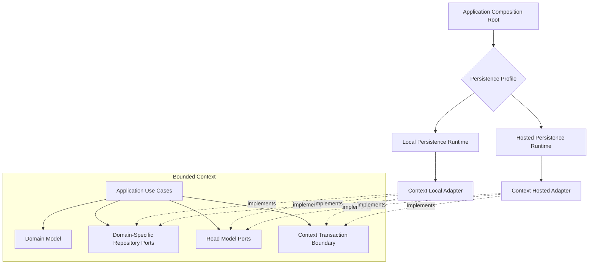

# Persistence Boundary

## Principle

Persistence is replaceable infrastructure, but data ownership and transaction
semantics are part of each bounded context.

Domain and application code must not depend on SQL dialects, ORM entities, database
clients, table schemas, or storage capability checks.



The application host selects one persistence profile during composition. Use cases
do not branch on `sqlite`, `postgres`, `desktop`, or `hosted`.

## Port design

Repository ports express aggregate semantics:

```ts
interface TaskRepository {
  get(scope: ProjectScope, id: TaskId): Promise<Task | null>;
  save(task: Task, expectedRevision: Revision): Promise<void>;
}
```

Query ports return purpose-built read models and do not rehydrate aggregates.

Do not introduce:

- `Repository<T>`;
- generic CRUD services;
- a universal aggregate table;
- ORM entities in domain or application;
- a shared SQL abstraction invented by the orchestrator;
- database capability checks inside use cases;
- one transaction interface shared across bounded contexts.

## Capability-scoped Unit of Work

Every mutating domain capability owns the smallest Unit of Work port that can
preserve its invariants. It bundles only the repositories and transactional
capabilities that the use case needs. It does not expose a database transaction,
driver, ORM session, or generic repository registry.

One bounded-context transaction coordinator assembles feature-owned Unit of Work
implementations over the selected persistence profile. This is technical
composition, not ownership of feature repositories or schemas. Nested,
cross-context, and caller-provided transactions are prohibited.

## Context-local transaction

One transaction may atomically change only one bounded context:

```text
aggregate state
+ aggregate revision
+ context-local projections required by the command
+ integration-event outbox records
+ durable command-dispatch records
= one local database transaction
```

An event consumer stores its inbox decision, cursor where applicable, and business
effect in the same context-local transaction.

Cross-context transactions, foreign keys, direct joins, and table writes are
prohibited. Query Composition joins published read models at the edge.

## Physical ownership

Each bounded context owns:

- repository and query adapters;
- tables and indexes;
- one ordered migration manifest assembled from feature-owned contributions;
- outbox and inbox schemas;
- durable command-dispatch schemas;
- projection checkpoints;
- retention and archival rules;
- backup/restore validation for its data.

A platform persistence package may provide connection factories, driver wrappers,
transaction primitives, migration execution, health checks, and test harnesses. It
does not define context tables, repositories, or migrations.

Sharing a physical database server or connection pool does not merge context
ownership.

## Local and hosted profiles

The initial production topology is:

- one embedded SQLite database file per bounded context for desktop/local
  operation;
- one PostgreSQL database with one schema per bounded context for the initial
  hosted deployment;
- separate context-owned adapters and dialect migrations;
- shared technical test harnesses plus context-owned semantic conformance suites.

Alternative profiles may be added at the application composition root without
changing domain or application behavior.

Exactly one profile is authoritative for each bounded context in one running
deployment. A Desktop connected to a hosted orchestrator uses hosted authority;
local storage may hold explicitly disposable client cache or client-owned state
but never a fallback aggregate repository. Local and hosted databases are not
dual-written or synchronized table by table. Context movement uses the logical
transfer protocol defined by ADR-0048.

### Desktop SQLite

Each bounded context receives its own database file and connection lifecycle:

```text
data/
  orchestration-scope.sqlite3
  team-topology.sqlite3
  work-coordination.sqlite3
  run-orchestration.sqlite3
  agent-communication.sqlite3
```

Context files are not attached for cross-context joins or transactions. Query
Composition calls published read APIs or maintains a disposable edge projection.

The local persistence runtime owns WAL configuration, busy handling, checkpointing,
integrity checks, version compatibility, and online backup primitives. A
multi-context product backup uses a mutation barrier and manifest; it does not
pretend that separate files share one transaction.

The runtime baseline is Node.js 24 LTS with `>=24.18.0 <25` enforced by repository
tooling. The first local driver is `node:sqlite`. Application ports remain
asynchronous even though the adapter executes a synchronous `DatabaseSync`
transaction.

Mutating use cases enter one single-writer command lane per bounded context before
opening their Unit of Work. No network, broker, runtime, filesystem, Temporal, or
other externally observable effect occurs inside that transaction. Complete
outbox or durable command-dispatch intent is committed first.

A command lane is bounded in both admission and scheduling. It must not drain an
unbounded burst of synchronous SQLite transactions in one event-loop turn.
Queue depth, transaction latency, timer lag, busy time, and rejection are
observable. The local composition applies explicit backpressure when its
configured latency or queue budget is exceeded.

The initial in-process scheduler services one durable command per turn and yields
within a five-millisecond time budget. Admission capacity is deployment-profile
configuration, not an unbounded library default. Command work, control-feed reads,
and outbox claim/mark operations receive fair scheduling; batching cannot starve a
capability behind the command queue.

A separate persistence worker is not the default. If measurement proves that
synchronous work causes unacceptable event-loop latency, the complete
bounded-context command lane moves to a Worker Thread. Repositories do not become
independent RPC services and a transaction token is not passed across calls.
Worker isolation does not relax admission or fairness limits.

The initial Worker-promotion benchmark runs the target workload at least three
times after bounded admission and time slicing are enabled. Promotion is justified
by repeated Host-responsiveness failure, such as timer or heartbeat drift p99 over
10 ms, event-loop delay p99 over 20 ms, or event-loop delay max over 50 ms.
Command queue latency alone first triggers backpressure or capacity changes, not
Worker extraction. These initial thresholds must be revalidated on packaged
desktop targets and may be tightened by product SLOs.

### Hosted PostgreSQL

The initial hosted deployment uses one PostgreSQL database with schema-qualified
context namespaces:

```text
tenant_project_registry.*
team_topology.*
work_coordination.*
run_orchestration.*
agent_communication.*
```

Schemas are ownership namespaces, not permission to join contexts. Cross-schema
foreign keys, writes, transactions, and direct query composition remain
prohibited.

SQL uses explicit schema qualification rather than relying on a broad
`search_path`. Each context owns its migration manifest. Runtime and migration
roles receive only the privileges required for their context schemas.

Future tenant routing may move a context or tenant to another database or cluster
without changing domain/application contracts.

The first hosted driver is `node-postgres`. Hosted command handlers may execute
concurrently, but repository revisions, idempotency, fencing where applicable,
and transaction outcomes must match the local profile's application semantics.

Every mutating capability declares its hosted concurrency profile before
implementation. It identifies the invariant, conflicting command set, revision
rule, constraints, lock order, isolation level, complete-Unit-of-Work retry
policy, and unknown-commit reconciliation. Local command-lane tests do not prove
hosted safety. Critical capabilities run real concurrent PostgreSQL conformance
scenarios as required by ADR-0050.

ADR-0078 makes that obligation executable through a federated build-time evidence
gate. Each discovered write entry point belongs to one mutation, every mutation
owns one consistency contract, every enabled persistence profile resolves a
compatible binding, and every selected strategy requires independent evidence.
Standard SQLite and PostgreSQL strategy mappings are declared once per context
adapter or profile rather than copied into every mutation. The gate does not
provide locks, transactions, or a production handler registry.

Primary-only reads are the default hosted consistency profile. Replica reads are
an explicit query capability with declared eventual-consistency or required-LSN
semantics. A reconnect never silently sends read-after-write traffic to a replica
that has not replayed the required LSN.

Replication durability is a deployment profile, not an adapter guess. An
asynchronous profile may lose acknowledged transactions after primary failure.
A synchronous `remote_apply` profile may provide a stronger tested RPO at the
cost of commit latency and dependency on standby availability. Every deployment
declares its RPO, degraded-write policy, promotion authority, and recovery
procedure.

Promotion publishes a new endpoint and monotonic deployment epoch. Pools and
checked-out clients are recreated, tenant context is rebound per transaction, and
stale expected epochs fail before mutation. The former primary remains fenced and
stopped until `pg_rewind` or reinitialization plus an authority decision makes it
safe to rejoin.

Physical PITR restores one PostgreSQL cluster and therefore all bounded-context
schemas in that cluster to one recovery point. The recovery coordinator validates
the requested target against immutable base-backup and WAL catalog metadata
before starting PostgreSQL. A target older than the base backup is rejected
before process creation because PostgreSQL itself may otherwise recover to the
earliest consistent point and become writable.

Restore readiness requires verified backup integrity, complete and uncorrupted
WAL through the target, promotion of a fresh isolated cluster, context watermark
checks, compatibility validation, and explicit endpoint activation. Missing,
corrupted, or insufficient WAL fails closed. Selective bounded-context restore is
a separate logical export/import and reconciliation operation, never a partial
physical PITR.

### Optional PgBouncer profile

Direct PostgreSQL is the canonical hosted semantic reference. PgBouncer
transaction pooling is a supported optional profile behind the same persistence
adapter contract when its exact PostgreSQL, PgBouncer, and `node-postgres` tuple
passes conformance.

Every Unit of Work retains one checked-out client for:

```text
BEGIN
-> bind verified tenant with transaction-local set_config
-> execute all repository operations
-> persist state, command receipt, and outbox
-> COMMIT or ROLLBACK
```

A repository cannot call the pool independently while a Unit of Work is active.
Every reconnect or whole-UoW retry obtains a client and binds tenant identity
again.

The transaction-pooled runtime profile prohibits session-scoped state, including
plain tenant `SET`, SQL-level `PREPARE`, `LISTEN`, session advisory locks,
preserved temporary tables, holdable cursors, and Unit of Work execution through
statement pooling. Protocol-level named statements require explicit PgBouncer
prepared-statement support and a conformance-tested nonzero cache setting.

Runtime traffic uses the PgBouncer runtime endpoint and constrained database role.
Migration and elevated maintenance use separate direct endpoints, credentials,
and pools. PgBouncer is neither an authorization boundary nor a substitute for
application tenant predicates and forced PostgreSQL RLS.

### Adapter-local Drizzle

Drizzle may provide query, schema, and migration tooling inside SQLite and
PostgreSQL persistence adapters. Drizzle types and generated models never enter
domain, application, feature contracts, or public SDK packages.

ADR-0052 selects Drizzle as the one default toolkit and direct drivers only as a
contingency. Versions are pinned exactly and verified through import, migration,
and conformance tests. The initial `node:sqlite` Drizzle integration is pre-GA, so
a dependency-readiness review is required before production materialization.
Released migrations remain immutable SQL artifacts and are not regenerated when
tooling changes.

Repository ports, Unit of Work semantics, aggregate-state mapping, stable errors,
and conformance fixtures remain shared. Physical schemas, migrations,
transactions, locking, engine operations, and dialect error classification stay
separate where their correctness proof differs. There is no universal repository,
base repository hierarchy, or dialect branch outside persistence adapters.

After the first two implemented repository pairs, the architecture review measures
actual duplication. It removes domain/application duplication, extracts proven
dialect-neutral adapter behavior inside its owning feature, and retains
irreducible physical behavior with paired conformance tests. An estimated
duplication percentage is not an architecture guarantee.

### Exact quantities, money, and instants

ADR-0046 governs authoritative counts, quantities, rates, and money.

- Domain and application code use context-owned exact value objects. Decimal,
  Dinero, Drizzle, and driver types remain adapter or implementation details.
- SQLite uses `INTEGER` only after a signed 64-bit range check and enables BigInt
  reads before consuming any result row. Wider coefficients and decimals use
  canonical text or coefficient-plus-scale columns. `REAL` is prohibited.
- PostgreSQL uses bounded `bigint` and `numeric(precision, scale)`. Node-postgres
  string results remain strings until context mapping.
- PostgreSQL exact values are cast to text before JSON construction. JSON numeric
  parsing is not a lossless codec for `bigint` or arbitrary-precision `numeric`.
- Every database aggregate has an explicit range or overflow strategy. SQLite
  integer `sum()` requires a proven safe bound; otherwise checked BigInt or exact
  decimal aggregation is used.
- Persistence records retain scale, unit, basis, currency, rounding policy, and
  algorithm/version references required by their owning context.

The initial exact mapping profile is:

| Semantic value | SQLite | PostgreSQL |
|---|---|---|
| Bounded whole count | `INTEGER` with BigInt reads | `BIGINT` read as string |
| Exact quantity | canonical coefficient `TEXT` plus `INTEGER` scale | coefficient `NUMERIC(P, 0)` plus `SMALLINT` scale |
| Money | canonical coefficient `TEXT`, scale, currency | coefficient `NUMERIC(P, 0)`, scale, currency |
| Exact instant | signed `INTEGER` epoch microseconds | `TIMESTAMPTZ(6)` read and written as text |

`P` comes from an explicit domain bound and overflow policy. SQLite exact
coefficient columns use text affinity and canonical validation, never `NUMERIC`
affinity. PostgreSQL special numeric values are rejected. A fixed-scale
`NUMERIC(P, S)` requires a later type-specific decision naming its insertion,
rounding, and overflow behavior.

The domain represents exact time as `ExactInstant` backed by epoch microseconds.
Wire form is UTC RFC3339 with fixed microsecond precision. JavaScript `Date` and
Temporal implementation objects do not enter persistence records, application
models, Published Languages, or SDK contracts. Provider timestamps with finer
precision remain raw evidence, while sequence, cursor, revision, or fence defines
business ordering.

SQLite and PostgreSQL may use different physical representations but must
round-trip the same canonical values and produce identical domain outcomes.

### High-volume facts and projections

Append-heavy usage observations and rated entries retain two physically distinct
responsibilities:

- a compact source-receipt ledger protects global source identity and
  deduplication across every retention window;
- immutable fact tables retain normalized or rated evidence and may be partitioned
  in hosted PostgreSQL after workload evidence selects the key and interval.

Deleting or detaching a fact partition cannot make an old source identity
acceptable again. Corrections append new facts with stable references to the
superseded evidence. Raw provider payloads may move behind a content-addressed
BlobStore reference without deleting the canonical receipt or normalized fact.

SQLite does not emulate PostgreSQL partitioning. Local retention uses bounded
batch deletion, archival, and checkpointed vacuum policy behind the same context
capability. The application observes identical receipt, correction, cursor, and
retention semantics rather than identical physical maintenance.

Rollups are versioned, rebuildable read projections. Each records source cursor,
watermark, projector version, and dimensional scope. Statistics may read them,
but budget admission, quota reservation, accounting close, and correction
authority use their owning aggregate state or authoritative facts. A projection
cannot silently become a write-model invariant because it is faster to query.

Driver errors are translated inside each adapter into stable persistence
outcomes. Raw SQLite error names, SQLite numeric codes, PostgreSQL SQLSTATE values,
and ORM exceptions never enter application contracts.

The transaction coordinator tracks commit progress internally:

```text
before-commit
commit-dispatched
commit-acknowledged
```

A dependency loss before commit is proven `not-committed` and may retry the exact
same command ID. Once commit has been dispatched, a lost response is
`unknown-outcome` regardless of the raw driver error. It is not automatically
retryable and is reconciled through the durable command receipt using the same
command ID. Commit phase never becomes a domain concept or public transport field.

SQLite corruption and `NOTADB` indicate untrusted state and enter controlled
recovery rather than transient availability retry. PostgreSQL adapters install
error listeners on the pool and every checked-out client because a connection
failure may emit independently of the rejected query. Unhandled driver events
cannot escape as process-level crashes.

JSON storage representation is not semantic identity. PostgreSQL `jsonb`, SQLite
text, Protobuf, and JavaScript objects may preserve or reorder fields
differently. Command fingerprints and idempotency comparisons use one versioned
canonical application representation before persistence.

## Conformance requirements

Persistence verification has three owners:

- platform-owned technical harnesses for transactions, crash simulation,
  migrations, and backup/restore;
- context-owned semantic suites for aggregate concurrency, scope, repositories, and
  queries;
- capability suites for event outbox, durable command dispatch, inbox, tenant
  isolation, and projection cursors when a context uses that capability.

Failure suites inject disk full, busy/locked/read-only state, corruption,
pre-commit disconnect, lost commit acknowledgement, timeout, deadlock,
serialization conflict, and dependency restart. They verify both atomic state
and stable safe error mapping.

PostgreSQL deployment suites additionally exercise asynchronous data loss,
synchronous commit, primary death, promotion, endpoint and epoch replacement,
old-primary fencing, replica-lag read rejection, WAL archive, physical base
backup, selected-point restore, and too-early, too-late, missing-WAL, and
corrupted-WAL negative controls.

SQLite and PostgreSQL implementations of the same context capability must pass the
same applicable semantic and capability suites. Tests verify behavior, not
identical SQL or identical performance.

Usage-capability persistence additionally verifies exact-value round trips above
`Number.MAX_SAFE_INTEGER`, decimal scale conversion, malformed canonical strings,
currency mismatch, allocation conservation, explicit rounding, SQLite BigInt read
configuration, integer aggregate overflow, PostgreSQL numeric codecs, exact values
inside JSON, microsecond instant preservation, negative epoch conversion, DST
period boundaries, and SQLite/PostgreSQL semantic parity.

Every supported PgBouncer profile runs the PostgreSQL semantic suite plus
transaction-pooling hazards, physical-backend switching, tenant-state reset,
prepared-statement behavior, endpoint separation, and whole-UoW retry after
backend loss.

## Migrations

Each feature owns the schema fragment and migration implementations for the tables
inside its outbound persistence adapter. A feature migration contribution declares
its semantic migration ID, dialect implementations, dependencies, and compatibility
metadata.

The bounded context assembles all feature contributions into one deterministic,
validated migration manifest. This assembly layer owns ordering and exposes one
context migration entry point; it does not absorb feature schemas or SQL.

Migrations are immutable after release. When multiple dialects are supported, one
semantic migration ID maps to dialect-specific implementations. The context plan
classifies each step as transactional or online-resumable.

Hosted zero-downtime changes use expand, migrate, and contract phases. Destructive
desktop migrations require a verified backup or another explicit forward-recovery
path before mutation.

The application composition root invokes each context migration entry point but
cannot edit, reorder, or merge context schemas. One migration runner and lock exist
per context deployment. Features never run migrations independently or compete for
that lock.

The migration lock covers bootstrap as well as migration execution. The PostgreSQL
adapter acquires its context-scoped advisory lock before creating or inspecting
migration metadata. The SQLite adapter acquires its cross-process bootstrap lock
before configuring WAL, creating metadata, or running migrations. Database busy
timeouts and `CREATE TABLE IF NOT EXISTS` do not replace this ownership lock.

For a transactional step, SQL, immutable checksum history, and the completed
watermark commit atomically. An online-resumable step first records immutable
intent and generation, then executes an idempotent non-transactional operation,
reconciles ambiguous outcome, verifies postconditions, and only then records
completion. A process that loses acknowledgement re-reads state under the same
lock; it does not reapply blindly. Incomplete, failed, or newer-than-supported
steps reject normal application startup unless an explicit compatibility phase
permits coexistence.

## Tenant isolation

Tenant and project scope are mandatory inputs to repositories and queries for
tenant-owned state. Database constraints and hosted row-level controls provide
defense in depth; they do not replace application authorization.

The hosted PostgreSQL profile applies two independent controls:

1. application commands and repositories derive `TenantId` from verified
   authority context and include `tenant_id` in every tenant-owned read and write
   predicate;
2. the PostgreSQL adapter binds that verified tenant with transaction-local
   `set_config(..., true)`, and hosted tenant tables enable and force row-level
   security.

Session-level `SET` is forbidden for tenant identity because pooled connections
can leak it to later borrowers. A failed transaction is rolled back before client
release. Every retry obtains or reuses a valid connection, opens a new
transaction, and binds tenant context again.

Runtime, migration, and elevated maintenance or cross-tenant dispatcher work use
separate pools and credentials. Runtime roles are non-superuser, have no
`BYPASSRLS`, and cannot assume elevated roles. Table owners and `BYPASSRLS`
identities are never runtime traffic identities. Elevated background work still
carries explicit tenant identity in durable records, outbox envelopes, logs, and
audit.

The hosted persistence adapter may later route tenants between shared schemas,
dedicated databases, or dedicated clusters. That routing remains outside domain
and application code.

## Backup and restore

Backup is not a raw file-copy assumption. Every profile defines:

- consistency point across its context stores;
- mutation pause or online-snapshot protocol;
- encryption and secret handling;
- retention and rotation;
- integrity verification;
- restore rehearsal;
- behavior when one context restore fails.

A multi-context product backup needs a manifest with context versions and a
coordination barrier. It does not create a cross-context transaction.

The live local backup protocol uses a technical product coordinator over narrow
context-owned backup participant capabilities:

```text
ProductBackupCoordinator
  -> request one generation and deadline
  -> each context closes command admission
  -> each context drains its current Unit of Work
  -> each context records its local watermark and creates its artifact
  -> coordinator verifies and activates one versioned manifest
  -> every context resumes admission
```

The coordinator owns generation, participant set, deadline, recovery journal,
manifest publication, and all-participant release. It cannot access repositories,
tables, migrations, or command lanes directly. Each bounded context owns
admission, Unit of Work drain, artifact creation, schema/migration metadata, and
local compatibility validation.

The manifest records a separate watermark, schema/migration identity, application
compatibility watermark, generation, size, and integrity hash for every context.
It explicitly declares that there is no cross-context transaction or global
watermark. A participant timeout aborts the entire generation and cannot update
the active backup pointer.

Restore acceptance requires more than a database engine integrity check. Before a
restored context becomes active, the adapter verifies:

- physical integrity appropriate to the engine;
- expected schema objects and constraints;
- immutable migration IDs and checksums;
- supported applied-version watermark;
- context and backup-manifest identity;
- capability invariants such as state, command receipt, and outbox consistency.

SQLite restore swaps a verified database file only while the owning Host is
stopped. Hosted disaster recovery restores a PostgreSQL cluster from a base backup
and continuous WAL to one recovery point. A schema-scoped dump is a logical
context export/import artifact with validation and reconciliation; it is not PITR
and must not replace unrelated context schemas implicitly.

Large provider payloads, prompts, logs, attachments, and artifacts do not live in
hot relational tables by default. Their owning feature stores metadata, content
hash, retention policy, and an opaque BlobStore reference. Local composition may
use a content-addressed filesystem adapter and hosted composition an S3-compatible
adapter. Credentials and encryption keys remain behind SecretStore capabilities,
never in context databases.

Local product restore supports two explicit modes:

- `all-or-nothing product set` requires and validates the complete expected
  context set;
- `explicit selective contexts` restores an operator-selected allowlist and is
  never an automatic fallback.

Restore runs under exclusive product maintenance with a durable recovery journal,
staging area, and rollback set. Because several SQLite files cannot be atomically
renamed as a group, startup recovery rolls back every partial activation before
the commit record, or completes cleanup after a committed activation. Normal
product access never observes a partially activated set.
