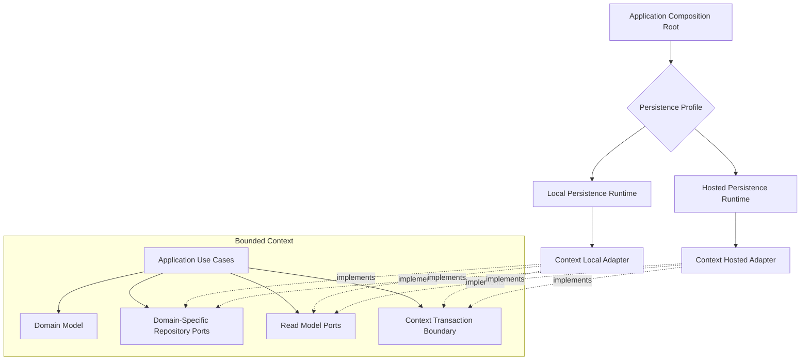

# Persistence Boundary

Status: **Accepted boundaries and storage topology; driver/tooling choices remain open**

## Principle

Persistence is replaceable infrastructure, but data ownership and transaction
semantics are part of each bounded context.

Domain and application code must not depend on SQL dialects, ORM entities, database
clients, table schemas, or storage capability checks.



The application host selects one persistence profile during composition. Use cases
do not branch on `sqlite`, `postgres`, `desktop`, or `hosted`.

## Port design

Repository ports express aggregate semantics:

```ts
interface TaskRepository {
  get(scope: ProjectScope, id: TaskId): Promise<Task | null>;
  save(task: Task, expectedRevision: Revision): Promise<void>;
}
```

Query ports return purpose-built read models and do not rehydrate aggregates.

Do not introduce:

- `Repository<T>`;
- generic CRUD services;
- a universal aggregate table;
- ORM entities in domain or application;
- a shared SQL abstraction invented by the orchestrator;
- database capability checks inside use cases;
- one transaction interface shared across bounded contexts.

## Context-local transaction

One transaction may atomically change only one bounded context:

```text
aggregate state
+ aggregate revision
+ context-local projections required by the command
+ integration-event outbox records
+ durable command-dispatch records
= one local database transaction
```

An event consumer stores its inbox decision, cursor where applicable, and business
effect in the same context-local transaction.

Cross-context transactions, foreign keys, direct joins, and table writes are
prohibited. Query Composition joins published read models at the edge.

## Physical ownership

Each bounded context owns:

- repository and query adapters;
- tables and indexes;
- migration manifests;
- outbox and inbox schemas;
- durable command-dispatch schemas;
- projection checkpoints;
- retention and archival rules;
- backup/restore validation for its data.

A platform persistence package may provide connection factories, driver wrappers,
transaction primitives, migration execution, health checks, and test harnesses. It
does not define context tables, repositories, or migrations.

Sharing a physical database server or connection pool does not merge context
ownership.

## Local and hosted profiles

The initial production topology is:

- one embedded SQLite database file per bounded context for desktop/local
  operation;
- one PostgreSQL database with one schema per bounded context for the initial
  hosted deployment;
- separate context-owned adapters and dialect migrations;
- shared technical test harnesses plus context-owned semantic conformance suites.

Alternative profiles may be added at the application composition root without
changing domain or application behavior.

### Desktop SQLite

Each bounded context receives its own database file and connection lifecycle:

```text
data/
  tenant-project-registry.sqlite3
  team-topology.sqlite3
  work-coordination.sqlite3
  run-orchestration.sqlite3
  agent-communication.sqlite3
```

Context files are not attached for cross-context joins or transactions. Query
Composition calls published read APIs or maintains a disposable edge projection.

The local persistence runtime owns WAL configuration, busy handling, checkpointing,
integrity checks, version compatibility, and online backup primitives. A
multi-context product backup uses a mutation barrier and manifest; it does not
pretend that separate files share one transaction.

### Hosted PostgreSQL

The initial hosted deployment uses one PostgreSQL database with schema-qualified
context namespaces:

```text
tenant_project_registry.*
team_topology.*
work_coordination.*
run_orchestration.*
agent_communication.*
```

Schemas are ownership namespaces, not permission to join contexts. Cross-schema
foreign keys, writes, transactions, and direct query composition remain
prohibited.

SQL uses explicit schema qualification rather than relying on a broad
`search_path`. Each context owns its migration manifest. Runtime and migration
roles receive only the privileges required for their context schemas.

Future tenant routing may move a context or tenant to another database or cluster
without changing domain/application contracts.

## Conformance requirements

Persistence verification has three owners:

- platform-owned technical harnesses for transactions, crash simulation,
  migrations, and backup/restore;
- context-owned semantic suites for aggregate concurrency, scope, repositories, and
  queries;
- capability suites for event outbox, durable command dispatch, inbox, tenant
  isolation, and projection cursors when a context uses that capability.

SQLite and PostgreSQL implementations of the same context capability must pass the
same applicable semantic and capability suites. Tests verify behavior, not
identical SQL or identical performance.

## Migrations

Migrations are context-owned and immutable after release. When multiple dialects
are supported, a semantic migration ID maps to dialect-specific implementations.

Hosted zero-downtime changes use expand, migrate, and contract phases. Destructive
desktop migrations require a verified backup or another explicit forward-recovery
path before mutation.

Application startup coordinates migration order but cannot edit context schemas.
Only one migration owner may run for a context deployment.

## Tenant isolation

Tenant and project scope are mandatory inputs to repositories and queries for
tenant-owned state. Database constraints and hosted row-level controls provide
defense in depth; they do not replace application authorization.

The hosted persistence adapter may later route tenants between shared schemas,
dedicated databases, or dedicated clusters. That routing remains outside domain
and application code.

## Backup and restore

Backup is not a raw file-copy assumption. Every profile defines:

- consistency point across its context stores;
- mutation pause or online-snapshot protocol;
- encryption and secret handling;
- retention and rotation;
- integrity verification;
- restore rehearsal;
- behavior when one context restore fails.

A multi-context product backup needs a manifest with context versions and a
coordination barrier. It does not create a cross-context transaction.
