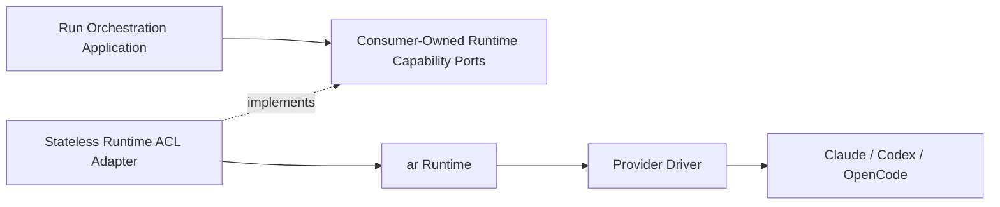

# Runtime Boundary

Status: **Accepted ownership model; contract details remain open**

## Principle

The orchestrator is the control plane. `ar` is the execution and safety runtime.
Provider implementations belong behind `ar`.



## Authority matrix

| Responsibility | Owner |
|---|---|
| Team, task, and message intent | Orchestrator |
| Assignment and completion policy | Orchestrator |
| Desired runtime state | Orchestrator |
| Provider capability selection policy | Orchestrator using runtime facts |
| Runtime process and worker lifecycle | `ar` |
| Provider session custody and resume | `ar` |
| Business cancellation, timeout, retry, and recovery policy | Run Orchestration |
| Runtime cancellation, timeout, and recovery mechanism | `ar` |
| Leases, fencing, sandbox, workspace isolation | `ar` |
| Provider API, CLI, SSE, and protocol translation | `ar` provider driver |
| User-facing projections | Orchestrator projections and client applications |
| Sidecar process supervision | Host composition, not agent-run ownership |

There must never be two writers for one runtime mutation or two supervisors for
one agent process.

Run Orchestration owns the durable `RuntimeBinding`, desired state, observation
projection, runtime-event inbox, and source cursor. `ar` owns the runtime run,
session, process, lease, fencing epoch, and provider cursor.

The Runtime ACL owns only translation and technical connection state. It must not
become a second durable owner of a binding, observation revision, or recovery state.

## Interface segregation and port ownership

One large `AgentRuntimePort` would force consumers and test doubles to depend on
capabilities they do not use. Each consuming application capability owns the
narrowest port it requires, for example:

```text
RuntimeCapabilitiesPort
RuntimeAdmissionPort
RuntimeLifecyclePort
RuntimeObservationPort
RuntimeEventStreamPort
RuntimeInputPort
RuntimeApprovalPort
RuntimeRecoveryPort
```

Names remain proposed until OD-004 is resolved. The Runtime ACL adapter may
implement several ports for convenient composition, but it does not own or export
those abstractions. Consumers request only the capabilities they use.

Capability discovery is explicit. Unsupported resume, approval, streaming, or
recovery behavior is represented as a typed capability/result, not an absent
optional method or provider-name branch.

The contract must support different topology models:

- one process per agent;
- one provider host with multiple sessions;
- remote managed execution;
- providers with or without interactive approvals;
- providers with or without native resume.

The orchestrator must not infer process topology from provider identity.

## Identity and fencing

Commands must carry enough identity to reject stale ownership:

- orchestration run ID;
- runtime run reference;
- aggregate generation or expected revision;
- idempotency key;
- correlation and causation IDs;
- orchestration-side expected generation;
- runtime fencing token when the runtime contract requires one.

Opaque runtime references must not be reconstructed from process IDs, paths, or
provider session names.

## Snapshots and events

Runtime events are facts emitted by `ar`. Orchestration projections combine those
facts with product state. Runtime snapshots are replaceable read models, not
orchestration aggregates.

Every orchestrator-facing snapshot needs:

- runtime reference and provider kind;
- observation timestamp;
- orchestrator observation revision;
- source event cursor or explicit `unavailable`;
- lifecycle and liveness state;
- freshness state: `fresh`, `stale`, `unknown`, or `unavailable`;
- progress evidence;
- pending interaction state;
- outcome or failure classification;
- warning and diagnostic codes;
- desired-state correlation without overwriting desired orchestration state.

If a provider cannot expose a monotonic revision, the Run Orchestration ingestion
handler assigns its own observation revision while preserving the absence of a
provider cursor. A stale snapshot is never silently interpreted as current
liveness.

## Runtime-event ingestion

The `ar` published contract defines:

- delivery semantics and replay support;
- runtime instance epoch and source cursor;
- duplicate, gap, and out-of-order signals available at the source;
- reconnect and replay from a supplied cursor;
- snapshot retrieval when replay is unavailable;
- behavior when a source cursor is explicitly unavailable.

The consumer-owned runtime integration contract defines normalized observation
semantics. Run Orchestration's internal persistence protocol defines:

- atomic persistence of inbox, cursor, and projection changes;
- local duplicate and out-of-order handling;
- observation revision allocation;
- snapshot reconciliation and gap state;
- the durable cursor supplied on reconnect.

When the source has no replayable cursor, the observation is marked
non-replayable. Reconciliation uses a fresh snapshot and never fabricates missing
history.

## Runtime-command idempotency

Mutating runtime commands require a durable command ledger or an equivalent `ar`
guarantee. The contract defines:

- idempotency-key scope and retention;
- payload hash validation for reused keys;
- replay of the original accepted result;
- unknown-outcome recovery after transport timeout;
- fencing and runtime-epoch behavior;
- safe retry rules for every mutation.

A retry of `startRun` after an unknown transport outcome must not create a second
runtime run.

## OpenCode target placement

OpenCode integration belongs in an `ar` provider adapter. Candidate legacy donor
modules include host/profile/session management, event streaming, permission
normalization, MCP handling, execution probes, and provider inventory.

The desktop and legacy orchestrator code are behavioral oracles, not code that can
be copied into the new core without classification.

## Migration rule

Use an anti-corruption adapter during migration:

1. freeze legacy behavior with contract tests;
2. implement the narrow orchestrator runtime ports against the legacy bridge;
3. implement the same conformance suite for the new `ar` provider adapter;
4. permit shadow reads where useful;
5. never permit dual writes or dual process ownership;
6. switch one capability at a time;
7. remove the legacy bridge only after parity and recovery verification.

## Host-level supervision

Desktop or server hosts may supervise the orchestrator and `ar` sidecar processes.
That does not make them owners of individual agent processes or sessions. The host
may restart a failed sidecar; `ar` recovers runtime ownership using durable state
and fencing.
