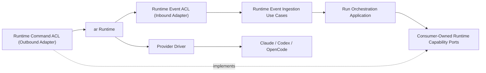

# Runtime Boundary

## Principle

The orchestrator is the control plane. `ar` is the execution and safety runtime.
Provider implementations belong behind `ar`.

The canonical implementation repository is
[`vioxen/agent-runtime`](https://github.com/vioxen/agent-runtime). Repository
location is informational; the versioned Runtime Published Language remains the
only integration authority.



## Authority matrix

| Responsibility | Owner |
|---|---|
| Team, task, and message intent | Orchestrator |
| Team messages, product inboxes, and coordination delivery | Agent Communication |
| Runtime input and provider output | `ar` |
| Assignment and completion policy | Orchestrator |
| Desired runtime state | Orchestrator |
| Provider capability selection policy | Orchestrator using runtime facts |
| Product approval policy, eligible approvers, and decision routing | Orchestrator |
| Making the product approval decision | Human or machine authority selected by Orchestrator |
| Technical runtime permission request and pending state | `ar` |
| Technical capability grant and provider enforcement | `ar` |
| Runtime process and worker lifecycle | `ar` |
| Provider session custody and technical session resume/reattach | `ar` |
| Runtime capacity allocation, provider-account leases, and credential custody | `ar` |
| Orchestration-run continuation | Run Orchestration |
| Business cancellation, timeout, retry, and recovery policy | Run Orchestration |
| Runtime cancellation, timeout, and recovery mechanism | `ar` |
| Leases, fencing, sandbox, workspace isolation | `ar` |
| Provider API, CLI, SSE, and protocol translation | `ar` provider driver |
| User-facing projections | Orchestrator projections and client applications |
| Local Orchestrator Host and managed component availability | Local Supervisor |
| Hosted Orchestrator Host and component availability | Deployment platform |
| AR host availability when packaged as a local managed component | Local Supervisor |

There must never be two writers for one runtime mutation or two supervisors for
one agent process.

Run Orchestration owns the durable `RuntimeBinding`, desired state, observation
projection, runtime-event inbox, and source cursor. `ar` owns the runtime run,
session, process, lease, fencing epoch, and provider cursor.

The Runtime ACL owns only translation and technical connection state. It must not
become a second durable owner of a binding, observation revision, or recovery state.

The same word may describe different concepts on each side of the boundary:

- an orchestration run and an `ar` runtime run have different lifecycles;
- orchestration continuation and technical session resume/reattach are different
  operations;
- product team messages and runtime input/provider output are different contracts;
- a product approval and a technical runtime permission are different state
  machines.

## Interface segregation and port ownership

One large `AgentRuntimePort` would force consumers and test doubles to depend on
capabilities they do not use. Each consuming application capability owns the
narrowest port it requires, for example:

```text
RuntimeCapabilitiesPort
RuntimeAdmissionPort
RuntimeLifecyclePort
RuntimeObservationPort
RuntimeEventStreamPort
RuntimeInputPort
RuntimePermissionDecisionPort
RuntimeRecoveryPort
```

Names remain proposed until OD-004 is resolved. The Runtime ACL adapter may
implement several ports for convenient composition, but it does not own or export
those abstractions. Consumers request only the capabilities they use.

Capability discovery is explicit. Unsupported resume, runtime-permission
interaction, streaming, or recovery behavior is represented as a typed
capability/result, not an absent optional method or provider-name branch.

The contract must support different topology models:

- one process per agent;
- one provider host with multiple sessions;
- remote managed execution;
- providers with or without interactive approvals;
- providers with or without native resume.

The orchestrator must not infer process topology from provider identity.

## Published Language and anti-corruption boundary

`ar` owns the canonical, versioned Runtime Published Language/API: wire schemas,
runtime events, command outcomes, errors, capability negotiation, ordering, and
replay semantics. Consumer-owned orchestration ports are internal application
abstractions, not wire contracts.

The Runtime ACL integration boundary maps between these models through separate
roles:

- an outbound command/client adapter implements consumer-owned capability ports;
- an inbound event adapter maps `ar` events into application inputs and invokes
  event-ingestion use cases.

They may share a low-level connection created by composition, but not one broad
adapter module. Orchestrator domain and application code must not import `ar` wire
schemas, and `ar` must not import orchestrator domain models. Both repositories run
the applicable shared contract fixtures against the same Published Language
versions.

## Runtime permissions and product approvals

The permission flow crosses two independently owned state machines:

```text
ar: RuntimePermissionRequested
  -> Runtime ACL
  -> Orchestrator: ApprovalRequest
  -> Authority decides
  -> Orchestrator: ResolveRuntimePermission
  -> Runtime ACL
  -> ar: decision acceptance and technical enforcement lifecycle
```

The orchestrator owns approval policy, eligible approvers, routing, product expiry,
and the durable audit record. The selected human or machine authority makes the
decision. `ar` owns the technical request, capability scope, pending runtime state,
decision acceptance, capability grant, and provider enforcement.

The consumer-side decision command must carry the information required by the
canonical `ar` contract:

```text
permissionRequestId
decisionId
idempotencyKey
expectedRequestRevision
expectedCapabilityScopeHash
decisionValidUntil
authorityDecisionRef
```

`authorityDecisionRef` is an opaque audit reference. `ar` does not interpret
orchestrator users, roles, or approval aggregates. Signed `DecisionAttestation` is
deferred until an untrusted network boundary requires it.

`ExecutionFence` is AR-internal technical authority. It never crosses the Runtime
Published Language, Runtime ACL, orchestrator persistence, logs, diagnostics, or
public client contracts. Product clients submit the decision and product evidence.
AR resolves and validates the current internal fence atomically before recording
provider-enforcement intent.

OD-004 may add an opaque, non-authorizing published concurrency guard to the
decision command. The orchestrator never reconstructs such a guard from an
attempt, epoch, process, path, or provider identifier.

The orchestrator treats duplicate, `stale`, `conflict`, and `expired` results as
normal typed outcomes. It must not translate them into an unclassified transport
failure or assume they produced a provider side effect.

The canonical decision semantics require:

- the same `decisionId` with the same canonical payload returns the previously
  recorded result;
- the same `decisionId` with a different payload returns `conflict`;
- stale request revision, published concurrency precondition, validity deadline,
  or capability scope produces no provider side effect.

Decision acceptance is not provider enforcement. The orchestrator observes and
reconciles the distinct runtime lifecycle outcomes published by `ar`, including:

- decision accepted;
- enforcement succeeded;
- enforcement failed;
- enforcement outcome uncertain;
- runtime session resumed.

An uncertain outcome is never blindly retried. Recovery follows the capabilities
declared by `ar`: provider idempotency, state reconciliation, or controlled
recovery.

## Identity and fencing

Commands must carry enough identity to reject stale ownership:

- orchestration run ID;
- runtime run reference;
- aggregate generation or expected revision;
- idempotency key;
- correlation and causation IDs;
- orchestration-side expected generation;
- canonical non-authorizing runtime concurrency guard when the published contract
  requires one.

Opaque runtime references must not be reconstructed from process IDs, paths, or
provider session names.

The public control API may expose a non-authorizing execution epoch for
observation and stale-attempt diagnostics. It never exposes an execution fence or
accepts an epoch as proof of runtime authority.

An execution epoch and an execution attempt are not interchangeable. Reattachment
to the same live provider process may advance `executionEpoch` while retaining the
same `attemptId`. A new provider process or invocation creates a successor
attempt. The orchestrator treats both values as runtime observations and never
infers attempt identity from an epoch change.

`RuntimeSession`, `ExecutionAttempt`, `ExecutionCustodyEpoch`, `ExecutionSlot`,
`RuntimeAllocationRef`, `ProviderAccount`, and `CredentialCustody` belong to AR's
model. The Runtime ACL does not assume allocation, account, custody, or slot
identities are published and does not reproduce that hierarchy. When AR explicitly
publishes a provider-neutral correlation reference, the ACL preserves it as opaque
and non-authoritative. Run Orchestration never stores raw runtime credentials,
account custody, or authoritative capacity allocation.

## Snapshots and events

Runtime events are facts emitted by `ar`. Orchestration projections combine those
facts with product state. Runtime snapshots are replaceable read models, not
orchestration aggregates.

Public runtime observation APIs keep control and output feeds distinct. A
session-wide merged stream cannot claim one durable cursor or ordering guarantee
unless the Runtime Published Language explicitly provides it.

The v1 Runtime ACL consumes separate control and output feed capabilities. It
neither requires nor synthesizes a merged session feed. Exact AR SDK method names
remain owned by AR.

Every orchestrator-facing snapshot needs:

- runtime reference and provider kind;
- observation timestamp;
- orchestrator observation revision;
- source event cursor or explicit `unavailable`;
- lifecycle and liveness state;
- freshness state: `fresh`, `stale`, `unknown`, or `unavailable`;
- progress evidence;
- pending interaction state;
- outcome or failure classification;
- warning and diagnostic codes;
- desired-state correlation without overwriting desired orchestration state.

If a provider cannot expose a monotonic revision, the Run Orchestration ingestion
handler assigns its own observation revision while preserving the absence of a
provider cursor. A stale snapshot is never silently interpreted as current
liveness.

## Runtime-event ingestion

The `ar` published contract defines:

- canonical schema versions and compatibility policy;
- typed command outcomes and safe error semantics;
- delivery semantics and replay support;
- runtime instance epoch and source cursor;
- duplicate, gap, and out-of-order signals available at the source;
- reconnect and replay from a supplied cursor;
- snapshot retrieval when replay is unavailable;
- behavior when a source cursor is explicitly unavailable.

Control/lifecycle observations, bounded-retention output, and large artifacts
have different retention and ordering requirements. The Runtime ACL tracks their
source feeds and cursors independently. A merged convenience view cannot invent a
global ordering guarantee or one durable cursor; exact feed names and the runtime
SDK surface remain owned by `ar`.

The consumer-owned runtime integration contract defines normalized observation
semantics. Run Orchestration's internal persistence protocol defines:

- atomic persistence of inbox, cursor, and projection changes;
- local duplicate and out-of-order handling;
- observation revision allocation;
- snapshot reconciliation and gap state;
- the durable cursor supplied on reconnect.

When the source has no replayable cursor, the observation is marked
non-replayable. Reconciliation uses a fresh snapshot and never fabricates missing
history.

## Runtime-command idempotency

Mutating runtime commands require a durable command ledger or an equivalent `ar`
guarantee. The contract defines:

- idempotency-key scope, full-receipt retention, and reuse-detection horizon;
- payload hash validation for reused keys;
- replay of the original accepted result;
- unknown-outcome recovery after transport timeout;
- published stale-ownership outcomes and observable runtime-epoch behavior;
- safe retry rules for every mutation.

Internal fencing remains AR-owned and unpublished.

A retry of `startRun` after an unknown transport outcome must not create a second
runtime run.

The orchestrator interprets an expired-window outcome only within the
reuse-detection horizon promised by the Runtime Published Language. Runtime
request fingerprints follow versioned semantic canonicalization and are not
derived from raw Protobuf bytes.

Every orchestrator runtime mutation is dispatched only after the owning
context-local transaction commits desired state and durable command intent. AR
command acceptance is not proof of provider execution, continuation, or terminal
success. The orchestrator reconciles accepted, in-progress, completed, failed, and
uncertain outcomes through command identity and published observations.

## OpenCode target placement

OpenCode integration belongs in an `ar` provider adapter. Candidate legacy donor
modules include host/profile/session management, event streaming, permission
normalization, MCP handling, execution probes, and provider inventory.

The desktop and legacy orchestrator code are behavioral oracles, not code that can
be copied into the new core without classification.

Classification does not authorize copying a legacy implementation into the new
domain or application core. Legacy code may provide behavioral tests, contract
fixtures, algorithms that are re-derived against current invariants, and temporary
compatibility adapters. New domain behavior is implemented from accepted language,
invariants, and ownership boundaries rather than legacy class or module structure.

## Migration rule

Use an anti-corruption adapter during migration:

1. freeze legacy behavior with contract tests;
2. implement the narrow orchestrator runtime ports against the legacy bridge;
3. implement the same conformance suite for the new `ar` provider adapter;
4. permit shadow reads where useful;
5. never permit dual writes or dual process ownership;
6. switch one capability at a time;
7. remove the legacy bridge only after parity and recovery verification.

## Host-level supervision

The Local Supervisor may ensure and monitor Orchestrator Host availability and,
when packaging requires it, AR host availability. Hosted deployment platforms
perform the equivalent process-availability role.

This never transfers runtime semantics. Only AR starts, adopts, resumes, cancels,
or kills provider sessions and processes. A Supervisor may restart an unhealthy AR
host only through the AR-owned host lifecycle contract; AR then reconciles
execution ownership using durable state and fencing. The Supervisor and
Orchestrator Host never enumerate or terminate OpenCode, Codex, Claude, or another
provider process directly.
