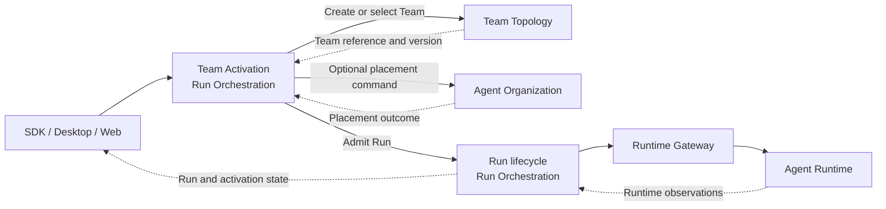

# ADR-0076: Team Activation Owned by Run Orchestration

## Context

The legacy Team provisioning flow combines Team persistence, organizational
placement, Run admission, participant activation, provider process startup,
permissions, progress, cancellation, diagnostics, and recovery. Its size is
evidence of mixed ownership, not evidence for one Team Provisioning bounded
context.

Creating a Team without starting a Run is a valid capability. Placement may
succeed or fail independently. Runtime execution and technical recovery remain
owned by AR. A separate Team Initialization bounded context would therefore
coordinate concepts whose invariants and lifecycles already have semantic
owners, while adding another store, Published Language, and failure boundary.

## Decision

Keep the responsibilities separate:

- Team Topology owns `CreateTeam`, cloning, template instantiation, immutable
  Team versions, roster, roles, and Team invariants.
- Agent Organization owns semantic Team placement in tenant-scoped structures.
- Run Orchestration owns a `team-activation` feature for the durable product
  process that combines Team creation or selection, optional placement, and Run
  admission.
- AR owns runtime sessions, provider processes, technical permissions, execution
  fencing, and technical recovery.

`CreateTeamAndStartRunProcess` is durable application process state inside
`team-activation`. It stores normalized intent, opaque Team and placement
references, child command identities, step requirement policy, partial outcomes,
cancellation state, retry state, and reconciliation evidence. It never copies
another context's aggregate or imports another context's domain model.

Step requirement is explicit. A placement or activation step may be required,
optional, or best-effort only when the accepted application policy says so.
Legacy best-effort behavior remains a compatibility mapping rather than an
implicit domain default.

Once Team creation commits, a later placement or Run failure does not delete the
Team. Cancellation prevents work that has not been durably admitted; it does not
pretend that an already committed Team, placement, Run, or runtime effect never
existed. Compensation is explicit and owner-specific.

Successful Team activation means that the Run reached durable admission under
the Run contract. It does not mean that every participant is ready or that a
provider operation has started. Participant readiness remains separately
observable under ADR-0067.

The feature does not define a generic provisioning plan, arbitrary workflow DSL,
provider configuration model, raw CLI arguments, runtime process model, or
cross-context transaction. A future Temporal adapter may execute its process
manager, timers, and retries without becoming the owner of Team or Run state.

A separate Team Initialization bounded context is reconsidered only when
evidence shows a lifecycle independent of Run, multiple material non-Run
processes, its own business invariants and Ubiquitous Language, independent
permissions or SLOs, and a useful Published Language that is not primarily a
composition of Team, placement, and Run commands.

## Consequences

- The composite user workflow remains durable without creating a coordination
  god-context.
- Team, organization, Run, and runtime invariants stay with their semantic
  owners.
- Partial outcomes and recovery are explicit, while committed Team state is not
  rolled back by unrelated downstream failure.
- Extracting Run Orchestration later carries the activation process with its
  business owner and preserves command and event boundaries.
- The compatibility facade must decompose legacy provisioning DTOs and progress
  into Team activation, Run, and runtime observations.

## Rejected alternatives

- Create a Team Provisioning or Team Initialization bounded context now.
- Put create-only, clone, template, and placement behavior inside Run
  Orchestration.
- Let Team Topology own Run admission or runtime recovery.
- Copy the legacy provisioning service or its provider-specific request model
  into the new application core.
