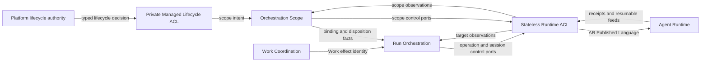
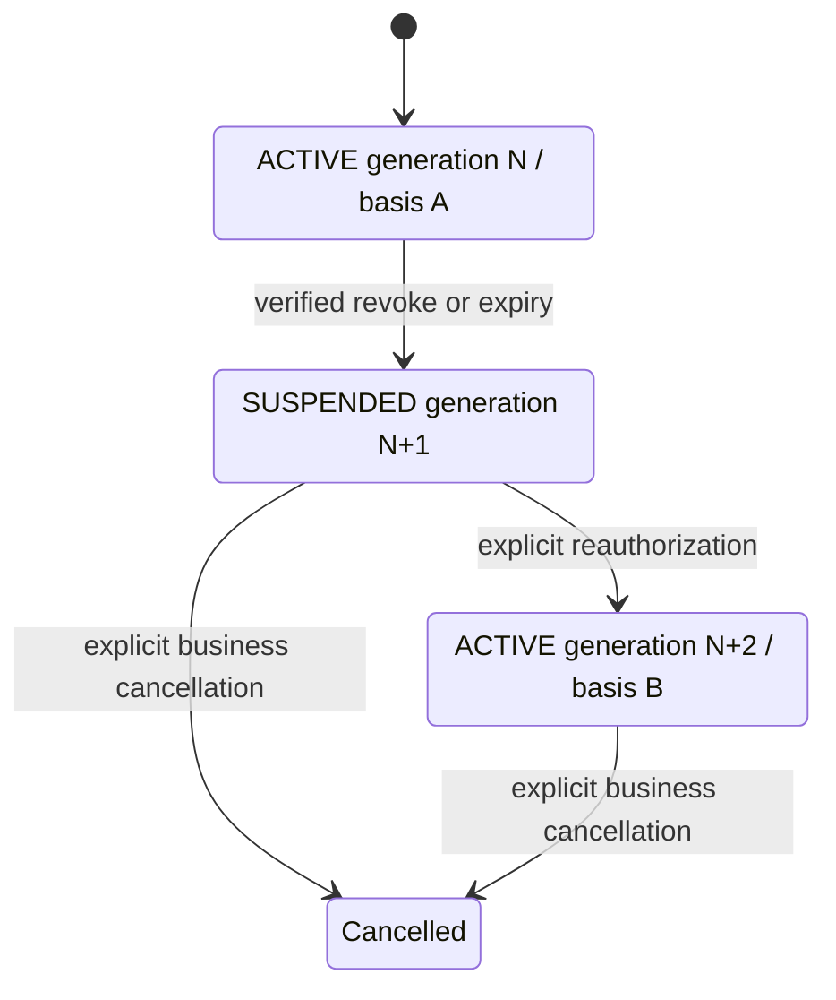

# ADR-0079: Runtime Authority, Binding, Cutoff, and Disposition

## Context

ADR-0008 correctly requires consumer-owned runtime ports and a stateless Runtime
ACL. It incorrectly assigns every durable runtime binding, observation inbox, and
cursor to Run Orchestration. That collapses project-level runtime placement,
participant-level association, event-ingestion progress, and Run execution into
one owner.

The accepted Agent Runtime ADR-0003 establishes three different technical cutoff
targets and four independent enforcement dimensions. It also establishes that AR
owns its Runtime Published Language, technical identities, revisions, private
fences, receipts, and disposition execution. The Orchestrator must consume those
semantics without copying AR aggregates or promising a transaction across the
system boundary.

Agent Runtime ADR-0004 accepts the pre-materialization negative operation-intent
guard for the case where prevention reaches AR before the original operation
command. Orchestrator core consumes it through a Run-owned port and cannot
duplicate the guard or its retention state. Exact producer fixtures remain an
implementation qualification gate, not an architecture-acceptance blocker.

Managed Platform lifecycle policy introduces another independent boundary. A
Platform project suspension or deletion may request Orchestrator scope
disposition, but Platform legal, retention, identity, and entitlement DTOs cannot
flow directly into AR. The Orchestrator must own the product intent and translate
only the required technical plan through its Runtime ACL.

Run authority revocation has a narrower meaning. Revoking one Run must not stop
unrelated Runs, a shared provider host, or an entire project scope. It must close
new Run dispatch, discover the Run's already accepted targets in bounded pages,
request the minimum safe AR cutoff for each target, and preserve truthful
containment and effect-reconciliation evidence.

The product owner has confirmed two v1 policies that constrain this design:

- one RuntimeSession is permanently associated with at most one independent Run
  in v1, including after that Run releases active use;
- reauthorization creates a successor RuntimeOperation and never reopens a cut
  predecessor operation.

Exact AR command names, Protobuf fields, enum values, TTLs, retention horizons,
PITR protocol, and production HA qualification remain owned by follow-up AR and
deployment decisions.

This ADR supersedes ADR-0008. It preserves consumer-owned ports and the stateless
Runtime ACL while replacing ADR-0008's single Run-owned binding, inbox, and
cursor assignment.

## Decision

### Strategic ownership

Runtime integration is split by the lifecycle and invariant being protected.

| Responsibility | Owner | Durable truth |
|---|---|---|
| External product lifecycle, membership, entitlement, and legal policy | Platform authority or Standalone Authority | Authority-provider state and evidence |
| Stable Orchestrator project identity, project-level runtime placement, binding generation, scope admission intent, and runtime-scope disposition intent | Orchestration Scope bounded context | Orchestration scope state and runtime owner-receipt references |
| Run lifecycle, Run authority basis and generation, participant association, runtime-target inventory, cutoff obligations, and successor dispatch policy | Run Orchestration | Run-owned aggregates and process state |
| Work lifecycle and semantic equivalence of Work effects | Work Coordination | Work-owned intent and effect identity |
| Runtime scopes, sessions, operations, dispatch authority, canonical output, provider containment, technical reconciliation, and technical disposition | AR | AR-owned state, revisions, fences, receipts, and feeds |
| Representation mapping and transport connection | Managed Lifecycle ACL or Runtime ACL | No business or binding state |
| Inbox rows, outbox rows, and checkpoint storage | Owning capability through persistence ports | Capability-owned semantics in its bounded-context store |

The accepted Orchestration Scope context is a supporting domain. It does not own
Platform Tenant or ProductProject lifecycle, Run participants, Work, AR sessions,
AR operations, or provider state.

Run Orchestration does not become a project-scope registry. Orchestration Scope
does not become a Run execution owner. AR does not interpret Run, Work,
membership, plan, billing, legal-hold, or product-retention concepts.



Each arrow crosses a typed contract boundary. No arrow implies a shared table,
cross-context Unit of Work, distributed transaction, or imported domain model.

### Two binding lifecycles

Project placement and Run participation use distinct records.

`RuntimeScopeBinding` belongs to Orchestration Scope. Its minimum semantic state
is:

```text
RuntimeScopeBindingId
OrchestrationTenantId
OrchestrationProjectId
RuntimeAuthorityRealmRef
RuntimeDeploymentRef
RuntimeDeploymentIncarnationRef
opaqueRuntimeTenantRef
opaqueRuntimeProjectScopeRef
bindingGeneration
scopeAdmissionRevision
desiredState
revision
```

These are proposed Orchestrator semantics. Exact resource names and public ID
shape remain governed by OD-019 and are not AR wire types.

One OrchestrationProject may have multiple bindings for managed, dedicated,
bring-your-own-cloud, hybrid, migration, or recovery placement. One binding ID
has at most one active generation. Rebinding to another realm, deployment,
incarnation, or runtime scope advances `bindingGeneration`. A Run never moves to
the new generation implicitly.

`RuntimeAuthorityRealmRef` identifies the stable AR trust and identity realm,
not an endpoint, cluster address, or host. Routing and endpoint discovery belong
to composition and transport adapters. Replacing an endpoint inside the same
realm, deployment, incarnation, and scope lineage does not advance
`bindingGeneration`.

Observed deployment authority, health, and AR scope state live in rebuildable,
reconcilable projections. They are not desired-state fields and cannot authorize
a mutation.

The authority projection keeps a separate checkpoint such as:

```text
RuntimeScopeBindingId + expectedBindingGeneration
RuntimeDeploymentRef
RuntimeDeploymentIncarnationRef
acceptedDeploymentAuthorityGeneration
observationRevision
feedIdentity + cursor or snapshot reference
```

The accepted generation is AR-owned observed authority, not an Orchestrator
fence. Advancing this checkpoint neither advances `bindingGeneration` nor moves
an existing Run. A gap, incarnation mismatch, stale attestation, or contradictory
generation closes dispatch and enters reconciliation; a larger observation alone
never grants authority.

`scopeAdmissionRevision` is the monotonic Orchestrator-owned linearization value
for opening, suspending, or reopening admission through one binding. It is not an
AR fence and cannot substitute for AR-owned runtime-scope revision, deployment
authority generation, or a current technical grant.

Run Orchestration cannot transactionally read Orchestration Scope state. Before
target admission it consumes versioned scope-admission evidence through a
consumer-owned port. The evidence binds the RuntimeScopeBinding ID and generation,
expected `scopeAdmissionRevision`, deployment audience and incarnation, AR scope
revision, evidence revision, and validity deadline. The scope port linearizes
evidence issuance against suspension. The Run target stores that exact evidence,
and the post-commit dispatcher performs a last-mile recheck before transmission.
Stale or unavailable evidence closes new dispatch and enters a typed pending or
reconciliation path.

The recheck cannot create a distributed transaction. If local dispatch admission
wins before scope suspension, the command is an admitted predecessor. AR then
serializes delayed dispatch against its own runtime-scope admission fence and
technical grant. Orchestrator `bindingGeneration` and `scopeAdmissionRevision`
remain opaque correlation to AR; AR stale decisions rely only on AR-owned
identities, revisions, generations, fences, and grants.

`ManagedRuntimeBinding` belongs to Run Orchestration. It is a bounded association
between one Run participant and the selected project binding generation. It
stores only product-owned desired state and opaque runtime references required by
its use cases:

```text
ManagedRuntimeBindingId
OrchestrationRunId
RunParticipantId
RuntimeScopeBindingId
expectedBindingGeneration
RunAuthorityGeneration
opaque runtime session or capability references
desiredState
revision
```

`ManagedRuntimeBinding` never contains an unbounded collection of RuntimeOperation
references, effects, receipts, output feeds, cursors, or history.

Each accepted runtime target is represented by a separate durable Run-owned
inventory entry, provisionally `RunRuntimeTarget`. It records the exact Run
authority generation, binding generation, opaque AR target reference, expected
published revision, semantic-owner effect reference, lifecycle classification,
and current cutoff-obligation reference. Exact aggregate and repository shape
remain subject to OD-006.

Every target begins as a local target-intent identity before an AR target
reference exists. The Run dispatch-admission transaction compares the exact
`RunAuthorityGeneration`, applicable `SemanticRevocationFence`, current binding
and scope-admission evidence, and target revision. It then compare-and-swap
updates the same authoritative Run authority gate used by suspension, allocates
the target sequence, and atomically persists the inventory entry, stable AR
command identity, dispatch state, and outbox. Suspension closes that gate and
captures its high-water mark through the same serialization boundary. AR
acceptance is never required inside that transaction.

If AR accepts the command but its response is lost, the target remains discoverable
by its local identity and original AR command identity. Cutoff first recovers the
original command disposition or receipt, obtains the opaque AR target reference
when one exists, and then requests target cutoff. It must not skip the target
because `runtimeOperationRef` has not yet been observed.

Cutoff can also win before AR has accepted or even observed the dispatch command.
AR ADR-0004 durably records a negative operation-intent guard bound to the AR
tenant and runtime-project scope, deployment and incarnation, original command
identity and expected canonical request digest, all applicable runtime-scope and
external-authority preconditions, and the prevention command identity and digest.
An opaque target-intent correlation is optional metadata, not identity authority.
Dispatch claim and this guard serialize in the same AR authority boundary. A
scoped `not found` without its durable receipt is not completion evidence; any
later matching dispatch must be rejected before provider side effect.

Target entries are scanned through stable bounded pages or snapshot ranges.
Historical entries and cutoff obligations survive reauthorization, Run
completion, restart, and restore through the declared enforcement and
reconciliation horizon.

### Session isolation and successor operations

In v1, one RuntimeSession reference can be associated with only one independent
OrchestrationRun ID for its complete lifetime in one runtime deployment
incarnation. The Orchestrator enforces this product allocation policy in its
binding and placement use cases and rejects both concurrent and later cross-Run
reuse visible in its authoritative inventory. AR still owns the technical session
identity, custody, and internal isolation mechanism. End-to-end qualification
therefore also requires AR capability evidence or an exclusive session-binding
precondition; an opaque reference check in the Orchestrator alone is insufficient.

Run Orchestration maintains a durable active session-allocation claim keyed by
runtime deployment incarnation and opaque RuntimeSession reference. Claim
admission is compare-and-swap or uniqueness protected so exactly one Run
association wins. Ending active use closes the claim but retains a non-reusable
association tombstone; it never permits reassignment to another Run. The owning
Run may reattach only with typed predecessor-barrier and AR continuity evidence.
Run completion alone neither proves continuity nor erases the tombstone. A
restored stale claim cannot authorize reuse across a newer deployment incarnation
or binding generation. Exact record and repository shape remain under OD-006.

A RuntimeSession may execute multiple sequential RuntimeOperations for its owning
Run association. Exact participant-to-session cardinality remains under OD-006;
this ADR does not authorize cross-Run sharing or infer session continuity from a
process, provider ID, epoch, or transport connection.

Future cross-Run sharing requires a new accepted decision and all of:

- explicit product policy and tenant-safe admission;
- qualified AR and provider operation-level execution, output, effect, and
  credential isolation;
- target-specific cutoff that cannot affect sibling Runs;
- conformance evidence for revocation, containment, delayed output, recovery,
  and shared-host failure.

An AR RuntimeOperation cutoff is monotonic. Reauthorization never mutates the cut
operation back to an active state. It creates a new Run target entry and requests
a successor RuntimeOperation after predecessor barriers permit dispatch.

If the successor represents the same intended business effect, the semantic
owner preserves the same stable business-effect identity. If it represents a new
effect, the semantic owner creates a new identity. AR validates exact identity
reuse and technical fingerprints but never compares prompts, payloads, commands,
or product intent to infer equivalence. The same-effect successor waits until AR's
typed predecessor barrier permits another operation for that identity.

The semantic owner cannot mint a new effect identity merely to bypass an unknown
or completed predecessor. Successor policy distinguishes:

| Predecessor result | Same-effect successor |
|---|---|
| Never dispatched or conclusively rejected | Allowed only with typed AR evidence that no effect was performed |
| Succeeded | Duplicate dispatch prohibited; consume the existing result |
| Acceptance or outcome unknown | Blocked pending reconciliation |
| Truthfully outcome indeterminate | Blocked by the permanent no-retry evidence for that effect |
| Different business effect | Independently evaluated after execution, output, and containment barriers |

### Business effect identity

There is no global business-effect registry. The bounded context that owns an
intent owns its semantic equivalence rule and stable effect identity. For Work
execution this owner is Work Coordination. Other features own their own effect
identities.

The semantic owner persists the identity, canonicalization version, and intent
fingerprint before asking Run Orchestration to place or dispatch the work. Every
effectful operation that is eligible for automated retry, recovery, or
reauthorization must pass the opaque business-effect identity and versioned
fingerprint through the runtime port. AR treats them as exact opaque identity and
conflict inputs; it does not infer semantic equivalence. If the qualified AR
contract cannot enforce them, same-effect automated successor dispatch is disabled
and an unknown outcome requires reconciliation or explicit operator disposition.

An unknown predecessor outcome blocks another dispatch for the same effect
identity. It does not automatically block a separately authorized unrelated
effect after execution, canonical output, and required containment barriers are
proven. Equality of content is never evidence of equality or difference of
business effects.

### Run authority and revocation fan-out

Run lifecycle, authority, runtime enforcement, and reconciliation are independent
axes:

```text
RunLifecycle
RunAuthorityState + RunAuthorityGeneration
per-target RuntimeBarrierEvidence
RunReconciliationState
```

A verified subject-bound revocation suspends Run authority. It does not mark the
Run terminal and does not claim that AR or a provider has stopped.



Revocation uses two independent durable fan-outs:

```text
authority revocation
  -> matching active Runs
  -> each suspended Run's accepted runtime targets
```

The authority-ingestion transaction validates the exact applicability tuple,
advances the semantic revocation fence, and appends one bounded Run-scan trigger.
It does not enumerate Runs. An `AuthorityRevocationFanOutProcess` scans the
authoritative subject-to-active-Run index in bounded pages against an explicit
snapshot boundary and sends an idempotent suspension command to each matching
Run.

Each matching authority generation is suspended in its own compare-and-swap
transaction. Direct `ACTIVE(basis A) -> ACTIVE(basis B)` reauthorization is
forbidden. The suspension transaction performs only Run-owned work:

1. compare the exact current authority basis, semantic fence, and Run authority
   generation;
2. record verified revocation evidence;
3. advance `RunAuthorityGeneration`;
4. block new placement and dispatch admission;
5. capture the target-inventory high-water mark for the suspended generation;
6. append one bounded target-cutoff trigger and transactional outbox records;
7. update the authoritative active-authority index without erasing historical
   obligations.

It does not enumerate every target and does not call AR.

If a successor basis arrives early, it is recorded as pending. It may become
`ACTIVE` only after the revoked predecessor generation has passed through the
durable suspension transaction and its bounded target-cutoff trigger exists. Full
technical enforcement need not finish before product reauthorization, but all
successor target dispatch remains closed by the predecessor barriers below.

A separate `RunAuthorityCutoffProcess` scans the Run target inventory in bounded
pages up to the captured high-water mark. It materializes one idempotent cutoff
obligation per matching target and generation. A retry resumes from its own scan
checkpoint rather than repeating an unbounded query. A target accepted after the
suspension cannot pass the generation and semantic-fence checks in its dispatch-
admission transaction.

Authority ingestion and both fan-outs keep their positions distinct:

| Position | Meaning | Owner |
|---|---|---|
| `IngestionCheckpoint` | Transport position durably consumed from one authority stream | Authority-ingestion capability |
| `SemanticRevocationFence` | Exact authority basis or proof revisions invalid for future Run and target admission | Run authority capability |
| Authority-to-Run scan checkpoint | Active-Run index range materialized as Run suspension commands | Authority revocation fan-out process |
| Run-to-target scan checkpoint | Target range materialized as cutoff obligations for one suspended generation | Run cutoff process |

Run admission and authority replacement check the semantic fence in the same
transaction that records the accepted basis and authoritative active-Run index.
Target insertion and dispatch admission check the same fence and exact
`RunAuthorityGeneration` in the transaction that creates the target and outbox.
These two checks close races both before Run discovery and before target
discovery.

Reauthorization advances the Run authority generation through compare and swap
only from the intervening suspended generation. It may restore product authority
while target dispatch remains closed by predecessor barriers. Revocation and
cutoff commands target the historical basis and generation, not merely the Run's
current basis. Old-generation cutoff obligations are never made stale or erased
because a successor basis was accepted.

Run suspension, cutoff, and late runtime completion do not mutate Work terminal
state. Work Coordination applies its own revision checks and the first valid
terminal commit rule from ADR-0066. Runtime outcomes arriving after suspension are
evidence for that Work-owned decision, not authority to bypass it.

### Target-specific cutoff

The Orchestrator requests the narrowest target that can satisfy product policy and
qualified runtime capabilities.

| Product condition | Default technical request | Constraint |
|---|---|---|
| One Run is revoked or cancelled | Cut off only its RuntimeOperations | Sibling Runs and provider hosts remain unaffected |
| Session authority, custody, workspace, credential, or provider binding is revoked | Cut off the RuntimeSession | Session-wide effect is explicit |
| Operation-level isolation cannot be proven | Cut off the RuntimeSession | Fail closed instead of claiming isolated cutoff |
| Project or runtime-scope admission is suspended | Suspend runtime-scope admission | Does not claim immediate child output fencing |
| Project scope is disposed | Start runtime-scope technical disposition | Separate resumable workflow after admission closure |

Scope cutoff is not a shortcut for ordinary Run revocation. Session cutoff is not
a default replacement for operation cutoff. Stopping a shared provider host is
not inferred from either command.

No Orchestrator transaction includes an AR mutation. The Orchestrator atomically
commits product state, target obligation, command identity, and outbox. AR owns
its independent authority linearization and receipt transaction.

Cutoff races therefore have two explicit linearization points:

1. the Orchestrator target dispatch-admission commit decides whether product
   authority admitted a durable AR command intent;
2. the AR dispatch-claim compare-and-swap decides whether provider dispatch became
   technically authority-started.

If revocation commits before the Orchestrator admission point, no target command
is admitted. If Orchestrator admission wins but AR cutoff wins before the AR
dispatch claim, AR can prove the provider effect was prevented. If AR dispatch
wins first, the effect may have started and revocation follows the containment
and reconciliation path. Adapter validation before process spawn or the first
network byte is defense in depth and cannot merge these two transactions.

When cutoff reaches AR before the original dispatch, its winning authority commit
creates the durable negative operation-intent guard described above. This is AR
command and admission state, not a fourth cutoff target or fence dimension. A
response that only states that no RuntimeOperation currently exists cannot
satisfy the predecessor barrier.

### Four independent runtime evidence dimensions

The Runtime ACL maps AR Published Language into a consumer-owned, provider-neutral
application model without copying AR domain enums. Operation and session target
projections keep four dimensions independently:

| Dimension | Question answered |
|---|---|
| Admission fence evidence | Can this target admit or dispatch new runtime work? |
| Canonical-output fence evidence | Can output from the predecessor authority enter canonical feeds? |
| Provider-containment evidence | Must separately continuing provider execution be stopped, and has that been proved? |
| Effect-reconciliation evidence | Is a possibly accepted external effect resolved or durably blocked from retry? |

For a runtime scope, only admission-fence state is authoritative at the scope
boundary. Canonical-output, provider-containment, and effect-reconciliation values
are child-receipt rollups over partial fan-out. They are reconcilable projections,
cannot authorize mutation, and cannot claim that every child target is fenced.

An `accepted` cutoff receipt proves only the target-specific authority commit
declared by AR. It does not prove all four dimensions, provider death, complete
scope fan-out, effect absence, or physical data disposition.

`partially_enforced` may exist as a query classification. It is never an
authoritative state or mutation precondition. Successor admission evaluates the
typed evidence required by the exact target and policy.

Provider containment may be mapped as not required only when AR returns qualified
technical capability and receipt evidence for the exact target closure. Platform
or Orchestrator product policy may require stronger containment but cannot weaken
the AR technical minimum.

### Predecessor barrier

A successor RuntimeOperation may dispatch only when all applicable predecessor
conditions are met:

- Run authority and binding generation are current;
- predecessor admission or execution authority is fenced;
- predecessor canonical output is fenced;
- required provider containment is proven, or qualified evidence states that it
  is technically not required;
- the same business-effect identity is not unresolved;
- AR accepts the new operation under current scope and technical authority.

Containment `pending` or `uncertain` blocks successor dispatch. An accepted cutoff
without typed barrier evidence is insufficient. Unrelated effect reconciliation
debt may remain after the containment barrier opens, but its exact identities stay
blocked from reuse.

### Consumer-owned ports and stateless ACLs

Ports are owned by the feature that consumes the capability. There is no broad
`AgentRuntimePort` or central runtime service interface. The initial semantic
port families are:

| Consumer | Port responsibility |
|---|---|
| Run cutoff feature | Request operation cutoff and recover its durable receipt |
| Run/session safety feature | Request session cutoff and recover barrier evidence |
| Orchestration Scope admission feature | Suspend or explicitly reopen runtime-scope admission |
| Orchestration Scope disposition feature | Submit and observe a technical disposition plan |
| Run runtime-ingestion feature | Consume target receipts, control observations, gaps, and snapshots |
| Orchestration Scope ingestion feature | Consume scope provisioning, authority, revocation, and disposition observations |

These are semantic responsibilities, not final interface or wire names. OD-004
owns exact methods and AR contract mappings.

The outbound Runtime ACL implements consumer-owned command ports. Separate inbound
ACL adapters map AR events, snapshots, and receipts into feature-owned ingestion
use cases. Generated AR DTOs, transport clients, authentication, and connection
state remain inside the ACL and composition packages.

The ACL has no durable binding, target inventory, cursor, checkpoint,
reconciliation, or disposition state. Persistence adapters store capability-owned
inbox and checkpoint records, but transport adapters do not own their semantics.

### Command outcomes and recovery

Every runtime mutation uses a durable command identity and canonical request
fingerprint persisted before dispatch. The consumer model must distinguish at
least:

- accepted target-specific authority change;
- already-terminal monotonic result;
- stale expected identity, revision, generation, incarnation, or authority;
- conflict from command identity reuse with different content;
- scoped not-found without cross-scope existence disclosure;
- transport unavailable before known acceptance;
- unknown delivery or lost acknowledgement requiring receipt query or replay.

A timeout never creates a new cutoff command automatically. Recovery queries or
replays the original command or receipt identity. Historical receipts and
no-retry evidence survive the complete retry, replay, restore, and stale-worker
resurrection horizon defined by the owning contract.

Canonical output committed by AR before cutoff remains valid predecessor output
even when transport delivers it later. The Orchestrator ingests it by target,
generation, event identity, sequence, and the final feed watermark; it cannot be
attributed to a successor or treated as current authority.

A provider observation produced after the winning AR output fence is different.
AR rejects it from the canonical feed and may retain only bounded redacted
reconciliation evidence. Cutoff barrier evidence therefore includes a final
canonical-feed watermark or an explicit typed unavailable, gap, or loss result.
Neither delayed case can reopen product authority, mutate a cut operation, erase
a tombstone, or authorize a successor by itself.

### Restore and anti-resurrection

After restoring an affected Orchestrator scope, runtime mutation admission stays
fenced until reconciliation proves current external authority, binding generation,
runtime deployment incarnation, AR scope revision, target inventory, command
receipts, and predecessor obligations. A restored projection alone is never
authority evidence.

Restored outbox records retain their original command IDs and canonical
fingerprints. They are not dispatched until the owning admission gate validates
their current generation and evidence. Recovery never mints replacement command
or effect identities merely because a receipt is missing.

The recovery workflow distinguishes AR ahead of Orchestrator, Orchestrator ahead
of AR, and independently restored states. A deployment-incarnation mismatch,
unknown receipt head, stale target reference, or conflicting binding generation
enters quarantine or reconciliation rather than selecting the newest timestamp or
replaying stale work. Exact PITR coordination remains open, but fail-closed
admission and identity reuse are fixed invariants.

### Runtime-scope disposition participation

Platform and AR disposition remain separated by two ACL boundaries:

```text
Platform lifecycle contract
  -> private Managed Lifecycle ACL
  -> OrchestrationProjectDispositionProcess
  -> Orchestrator-owned RuntimeScopeDispositionIntent
  -> stateless Runtime ACL
  -> AR-owned TechnicalDispositionPlan
```

The Managed Lifecycle ACL translates an external lifecycle decision into an
Orchestrator-owned intent with stable project identity, deletion epoch, policy
evidence references, and requested outcomes. Platform DTOs do not enter
Orchestrator domain code or the Runtime ACL.

ADR-0080 assigns whole-Orchestrator Project disposition coordination to the
separate `OrchestrationProjectDispositionProcess` feature inside Orchestration
Scope. That process owns only the versioned participant plan, bounded
obligations, and opaque owner receipt references. It never decides legal hold or
retention policy, reads another context's tables, deletes another owner's data,
or interprets another owner's detailed evidence.

The runtime-scope disposition feature defined here is one participant in that
whole-Project process. It owns the normalized AR intent and bounded receipt for
each applicable RuntimeScopeBinding lineage. Other Orchestrator bounded contexts
freeze and dispose their own state through their own Published Language.

The Runtime ACL maps only the approved technical categories, actions, expected AR
revisions, and opaque policy evidence needed by AR. AR validates and executes its
immutable technical disposition plan, provisionally named
`TechnicalDispositionPlan` by AR ADR-0003. AR remains responsible for runtime
sessions, operations, output, artifacts, logs, provider state, worker residue,
keys, backups, and technical receipts.

Unknown legal-hold or retention evidence fails closed as retain plus reconciliation
required. Admission closure, child cutoff, provider containment, logical access
closure, physical erasure, backup expiry, and cryptographic erasure remain
separate evidence. No owner may manufacture another owner's completion.

### Consistency and extraction boundary

Each bounded context owns its transaction, inbox, outbox, process state, and
checkpoint. There is no cross-context Unit of Work.

Within AR, runtime-scope admission authority, session execution authority,
operation dispatch authority, and canonical-output append remain in the
transactional deployment and store boundary required by AR ADR-0003. This is an
AR extraction constraint, not an Orchestrator-to-AR distributed transaction.

Within the Orchestrator, Run authority admission, its semantic revocation fence,
the authoritative active-authority index, and the Run authority gate must share
the transaction that accepts, suspends, or replaces a Run authority basis. Target
insertion and suspension serialize through that same gate so the target sequence
and suspension high-water mark cannot cross unnoticed. Target fan-out, AR
dispatch, receipt ingestion, and reconciliation occur after commit through
durable process state.

Orchestration Scope and Run Orchestration communicate through Published Language,
idempotent commands, events, and receipts. They do not import repositories or
write each other's tables.

### Conformance requirements

Implementation cannot claim this decision without deterministic tests for:

- project binding rebind and delayed generation-N observations after generation
  N+1 activates;
- endpoint replacement inside one realm/deployment/incarnation without a false
  rebind, plus realm or incarnation replacement that must advance binding
  generation;
- AR authority-generation advancement updating only the reconcilable authority
  checkpoint, never binding generation or an existing Run target;
- two endpoints claiming one incarnation without shared authority state being
  rejected as split brain;
- Run admission racing exact revocation-fence commit in both commit orders;
- target insertion and dispatch admission racing suspension in both commit orders;
- scope-admission evidence issuance and queued dispatch racing local and AR scope
  suspension in every commit order;
- authority-to-Run and Run-to-target fan-out crash and resume at every page and
  commit boundary without missed or duplicate obligations;
- reauthorization during either fan-out without erasing old-generation work;
- revocation before local dispatch admission, after local admission, before AR
  dispatch claim, after AR dispatch claim, and after provider bytes may have
  crossed the boundary;
- lost AR acknowledgement before and after AR commit and process crash before the
  opaque RuntimeOperation reference is stored;
- cutoff arriving before the original dispatch and leaving a durable negative
  operation-intent guard that rejects the delayed command before provider side
  effect;
- operation cutoff preserving sibling Runs and unrelated operations;
- forced session cutoff when operation-level isolation is unqualified;
- two independent Runs concurrently claiming one RuntimeSession, cross-Run reuse
  after release, same-Run reattach, stale release, and restored old allocation;
- reauthorization creating a successor operation without reopening its
  predecessor;
- never-dispatched, rejected, succeeded, acceptance-unknown,
  outcome-indeterminate, same-effect successor, and unrelated-effect cases;
- effectful retry or reauthorization without qualified opaque effect-identity
  enforcement remaining blocked rather than minting a replacement identity;
- accepted cutoff with containment pending, uncertain, contained, and qualified
  not-required evidence;
- delayed pre-cutoff canonical output versus post-cutoff stale provider
  observation, including replay gaps, watermark mismatch, and cursor expiry;
- lost acknowledgement followed by exact command or receipt replay;
- stale Run authority, binding generation, deployment incarnation, AR scope
  revision, and target revision substitution;
- stale or unavailable Orchestration Scope evidence while target dispatch is
  queued;
- restore before and after suspension, AR acceptance, receipt persistence, and
  reauthorization, including AR-ahead, Orchestrator-ahead, and stale-outbox
  resurrection;
- Work completion racing Run suspension and cancellation in both commit orders;
- Platform DTO and AR generated-type import negatives outside their ACLs;
- scope disposition with legal hold, missing evidence, partial owner receipts,
  backup retention, shared-key rejection, and restore-resurrection attempts;
- proof that projection lag, a transport cursor, or a derived summary cannot
  authorize mutation.

Cross-repository conformance has three owners:

1. AR proves its Published Language, authority, fencing, receipt, and disposition
   semantics.
2. Orchestrator proves consumer-port behavior, ACL mapping, product authority,
   target inventory, and process recovery.
3. Managed composition proves Platform lifecycle mapping through Orchestrator to
   AR without shared domain types or authority bypass.

### Deliberately open details

This ADR does not freeze:

- AR command, event, package, service, field, enum, or Protobuf names;
- exact consumer-port methods under OD-004;
- tactical aggregate and repository shape under OD-006;
- the physical storage and AR Published Language mechanism for the accepted
  lifetime session-allocation claim and whether a session may be shared inside one
  Run;
- generic external-action execution details under OD-032;
- exact authority TTL, clock-skew, retention, tombstone, and idempotency horizons;
- exact Orchestrator resource identity and public scope representation under
  OD-019;
- signed control-grant representation and key rotation;
- cross-system PITR and restore protocol;
- production high availability, stale-writer fencing, asymmetric-partition, and
  anti-rollback qualification;
- future policy and qualification for cross-Run RuntimeSession sharing.

Those decisions may refine representation and deployment but cannot collapse the
owners, target boundaries, independent evidence dimensions, monotonic cutoff, or
successor-operation rule accepted here.

### Acceptance synchronization

The accepting change set:

- marks ADR-0008 as superseded while preserving its compatible port and ACL
  principles through this decision;
- preserves ADR-0080's accepted Orchestration Scope identity, admission, binding,
  and whole-Project disposition ownership;
- consumes the accepted AR ADR-0004 negative operation-intent guard while keeping
  producer fixtures as implementation qualification;
- synchronizes the runtime boundary, reliability ownership, package catalog, and
  affected open decisions without materializing packages whose use cases have not
  started;
- keeps product and jurisdiction policy sources, legal-hold semantics, retention
  classes, and export detail open under OD-029 without reopening ADR-0080's
  coordination owner.

## Consequences

- Runtime integration remains replaceable because application features own narrow
  ports and ACLs own only translation.
- Project lifecycle, Run authority, Work meaning, and AR technical enforcement no
  longer share one ambiguous `RuntimeBinding` owner.
- Revocation is safe under concurrency without putting an unbounded target list in
  the Run aggregate.
- Reauthorization is explicit and auditable; it cannot resurrect a stale
  operation or silently discard predecessor uncertainty.
- Scope disposition can satisfy managed, standalone, dedicated,
  bring-your-own-cloud, and hybrid compositions without importing Platform
  policy into AR.
- More durable identities, target entries, obligations, and process states are
  required. This is the cost of truthful partial-failure and recovery semantics.
- ADR-0008's consumer-owned-port and stateless-ACL principles remain, while its
  single Run-owned binding, inbox, and cursor assignment is replaced.

## Rejected alternatives

- Keep every runtime binding, inbox, cursor, target, and receipt in Run
  Orchestration. This creates a god-context and gives Run ownership of project
  lifecycle.
- Store all RuntimeOperations and receipts inside `ManagedRuntimeBinding`. The
  collection is unbounded and has different concurrency and retention.
- Send Platform retention or legal DTOs directly to AR. This bypasses the
  Orchestrator product boundary and couples public runtime contracts to private
  Platform policy.
- Use one generic runtime cutoff command or one scalar enforcement state. The
  targets and consistency boundaries are different.
- Reopen a cut RuntimeOperation after reauthorization. This destroys monotonicity
  and makes delayed output and effect evidence ambiguous.
- Share RuntimeSessions across independent Runs by default. This makes isolated
  revocation depend on unproven provider behavior.
- Treat Runtime ACL as a durable gateway or cursor owner. This reverses Dependency
  Inversion and creates a second state authority.
- Call AR inside a Run or scope transaction. This cannot provide cross-system
  atomicity and creates uncertain commits without durable intent.
- Let AR infer business-effect equivalence from content. AR does not own product
  semantics and cannot make that decision reliably.
