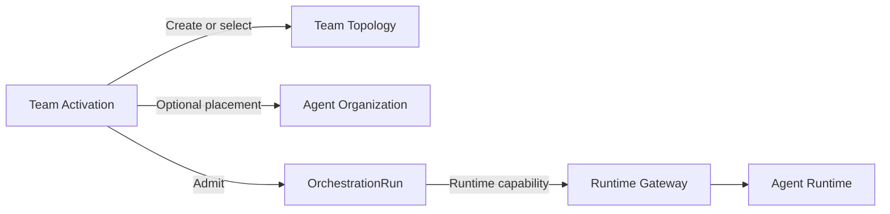

# Run Orchestration

Proposed scope: `OrchestrationRun` authority, immutable `RunPlanVersion`
artifacts, `RunPlanTransitionProcess`, resilience-policy snapshots, Run
participants and activation, `ManagedRuntimeBinding`, business checkpoints,
separate `RunRuntimeTarget` inventory, Run authority generation and cutoff
obligations, lifetime runtime-session allocation tombstones, business-effect
references, retry, escalation, completion, compensation, Work placement, and
desired-versus-observed reconciliation. Technical execution remains owned by
`ar`.

The `team-activation` feature owns the durable composite process that creates or
selects a Team, optionally requests organizational placement, and admits a Run.
Team persistence remains in Team Topology, placement remains in Agent
Organization, and technical execution remains in AR. The process stores only
opaque references, child command identities, typed step requirements, partial
outcomes, cancellation state, and reconciliation evidence.



Failure after Team creation never causes implicit Team deletion. Successful
activation means durable Run admission, not participant or provider readiness.
ADR-0076 owns the complete boundary.

ADR-0065 fixes the following consistency boundaries:

- `OrchestrationRun` is the small authority aggregate;
- `RunPlanVersion` is an immutable validated artifact;
- `RunPlanTransitionProcess` stages and promotes plan versions;
- `RunParticipant` is stable product identity while `ParticipantActivation`
  tracks one activation lifecycle;
- `WorkPlacement` is feature-owned durable application process state in this
  context;
- `WorkExecution` and all Task or Work lifecycle changes remain in Work
  Coordination;
- `RuntimeOperation` remains in AR.

ADR-0079 further fixes the runtime integration boundaries:

- `ManagedRuntimeBinding` is a bounded participant-to-runtime association and
  never an unbounded operation or receipt collection;
- `RunRuntimeTarget` is separate durable process state for one accepted runtime
  target and its exact authority evidence;
- Run authority admission, suspension high-water marks, and target registration
  serialize through one Run-owned authority gate;
- one RuntimeSession is permanently associated with at most one independent Run
  in v1 and leaves a non-reusable allocation tombstone;
- reauthorization creates a successor RuntimeOperation and never reopens its
  predecessor;
- consumer-owned ports express Run intent, while the Runtime ACL only translates
  representations and owns no binding, cursor, checkpoint, or recovery state.

`WorkPlacement` stores opaque Work references, expected revisions, participant
and binding references, checkpoints, and process state. It never copies the Work
aggregate. Reliable transport does not authorize either bounded context to infer
the other's policy.

The creation path is staged rather than one synchronous launch:

```text
CreateRun
  -> promote validated RunPlanVersion
  -> activate participants and establish runtime bindings
  -> place accepted WorkExecution
  -> request AR RuntimeOperation
  -> reconcile outcome back to Work Coordination
```

Runtime liveness, context application, pending interaction, participant
readiness, Run health, and completion assessment are independent facts.

The [Run authority executable specification](../../../../architecture/executable-specs/run-authority-state.json)
captures only the accepted ADR-0079 `RunAuthorityState` and generation pattern.
Its derived XState graph is test and visualization evidence, not a production
aggregate, Agent Runtime model, or claim that this proposed dossier is accepted.

Discovery artifacts are not yet complete. Use the
[bounded-context template](../../../templates/bounded-context.md) before changing
this dossier to accepted.
