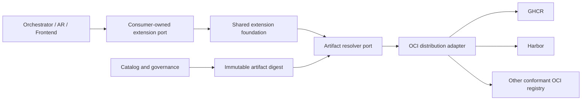

# OD-041: Shared Extension Foundation and Artifact Distribution

## Decision required

Should Orchestrator, Agent Runtime, and future Frontend products reuse a shared
technical extension foundation, and what exact distribution, catalog,
provenance, compatibility, and lifecycle contracts may that foundation own?

## Candidate direction under review

Create a separately versioned `agent-teams-ai/extension-foundation` repository
containing only product-neutral extension infrastructure:

- manifest, capability, permission-request, identity, and lifecycle protocols;
- profile and lock-file schemas;
- artifact digest, provenance, signature, and compatibility verification;
- registry resolution ports, OCI adapters, and registry conformance fixtures;
- extension host primitives for Node and browser-compatible environments;
- test kits, schema tooling, and AI-readable diagnostics.

Product-specific extension ports remain consumer-owned in Orchestrator, Agent
Runtime, or Frontend. The foundation must not import their domain models or
expose a global service locator.

## Registry and catalog boundaries

- GHCR and Harbor are replaceable OCI distribution providers, not domain
  concepts and not separate product architectures.
- The baseline should use one OCI distribution adapter plus narrow
  provider-specific authentication, discovery, and policy profiles. A provider
  gets a separate adapter only when a proven semantic difference cannot be
  isolated behind those profiles.
- GHCR stores versioned OCI packages in GitHub's package registry. An artifact
  may be linked to a source repository, but its blobs and manifests do not live
  in Git history.
- Both GHCR and Harbor may host private extensions. Harbor is additionally a
  self-hosted option for organizations that require infrastructure control,
  private networking, replication, or independence from GitHub.
- The artifact registry stores and transfers immutable bytes. A catalog or
  marketplace separately owns discovery metadata, publisher governance,
  compatibility claims, moderation, revocation, and product presentation.
- Mutable tags are discovery hints only. Profiles, installation records,
  activation, rollback, and audit pin an immutable OCI digest.

OCI Distribution, ORAS, and Cosign are candidate standards and tools rather than
domain dependencies. The exact library and process integration remains open
until spikes prove Node, browser, hosted, and future Fully Local requirements.

## Required proof before acceptance

- the same fixture can be published, resolved, verified, installed, and rolled
  back through GHCR and Harbor without leaking provider types into product code;
- public and private authentication, scoped credentials, logout, credential
  rotation, and unavailable-registry outcomes are covered;
- signatures, provenance, digest pinning, revocation, and compromised-publisher
  recovery have executable threat fixtures;
- incompatible protocol, capability, permission, and host-generation outcomes
  fail closed with actionable diagnostics;
- publishing and installation have a product CLI/API so users do not need to
  understand raw OCI, ORAS, or Cosign commands;
- catalog unavailability does not corrupt installed extension state, and catalog
  authority cannot replace product authorization or runtime enforcement;
- at least two independent product integrations exercise shared primitives
  without importing each other's domain contracts.

## Explicit non-goals

- implementing a custom container registry;
- using Git tags or package tags as installation identity;
- centralizing product-specific extension ports in the foundation;
- treating registry visibility as product authorization;
- declaring hot update, marketplace governance, or public SPI accepted through
  this proposal.

## Resolution

Open. This document records a candidate direction only. Acceptance requires a
dedicated ADR after the conformance, security, lifecycle, and product-boundary
spikes above.
