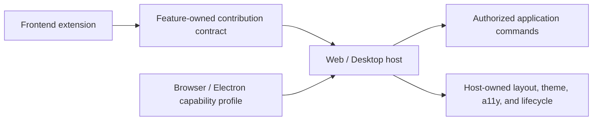

# OD-042: Frontend Extension Contribution Model

## Decision required

How should future Web and Desktop clients expose extension points without
coupling the shared foundation to a UI framework, Electron, application state,
or a global plugin manager?

## Candidate direction under review

Use framework-neutral contribution contracts owned by the consuming Frontend
features. Candidate contribution categories include:

- commands and command handlers;
- menus, toolbars, and contextual actions;
- views, panels, and navigation locations;
- settings schemas and settings editors;
- activity and execution-observation renderers;
- artifact previews and editors.

Names such as `ViewContributionPort` and `CommandContributionPort` are
provisional. The final ports must be narrow, feature-owned, versioned, and
validated by the host. An extension cannot resolve arbitrary application
services, deep-import UI internals, mutate global client state, or bypass command
authorization.

The Web and Desktop clients should share logical contribution contracts while
negotiating different environment capabilities. Electron-only filesystem,
process, or local-host access stays behind adapters with separate permissions and
is never implied by installing a UI contribution.

Candidate rendering tiers to evaluate are host-rendered declarative UI,
sandboxed web content for richer interfaces, and trusted in-process components
for first-party modules. The final decision must define accessibility,
internationalization, theming, routing, persistence, crash isolation, resource
budgets, and safe fallback behavior for every tier.

## Questions that remain open

- which frontend framework and module-loading mechanism will be used;
- which contribution categories belong in the first public SPI;
- whether rich third-party UI runs in an iframe, Worker-backed sandbox, separate
  process, or another isolation boundary;
- whether install or update without full application restart is required, and
  how generation drain, state migration, rollback, and leaked resources are
  proven;
- how layout ownership and contribution conflicts are resolved without relying
  on registration order;
- how signed artifacts, permissions, publisher trust, revocation, and offline
  operation appear in the user experience;
- which contracts can be shared by Web and Desktop and which require explicitly
  different capability profiles.

## Required proof before acceptance

- two independent frontend extensions exercise every proposed public
  contribution point;
- a conformance suite proves lifecycle, cleanup, crash isolation, capability
  denial, version mismatch, and deterministic conflict handling;
- extension UI cannot access secrets, Node/Electron APIs, tenant data, or host
  state without a narrow granted capability;
- an extension update can be rolled back without corrupting layout, settings, or
  product state;
- accessibility, keyboard navigation, localization, theming, and responsive
  behavior are host-enforced rather than optional conventions.

## Resolution

Open. This is a proposal for later critique, not an approved Frontend
architecture or permission to publish a public SPI.
